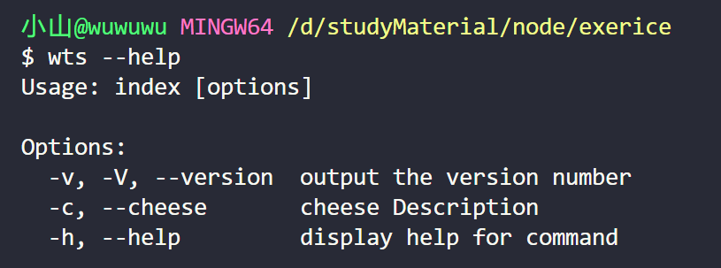
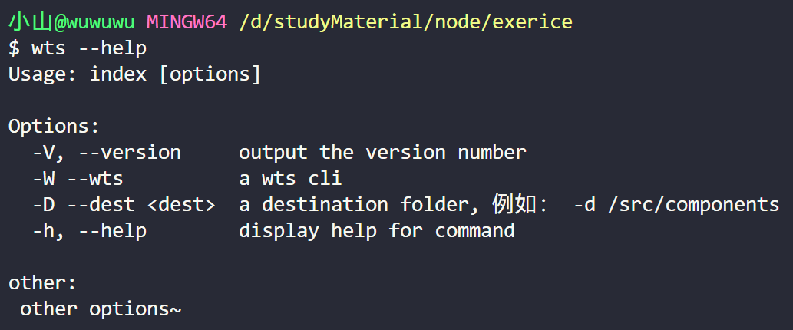
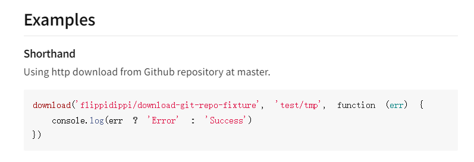
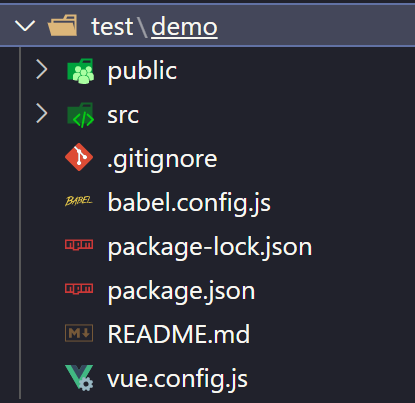
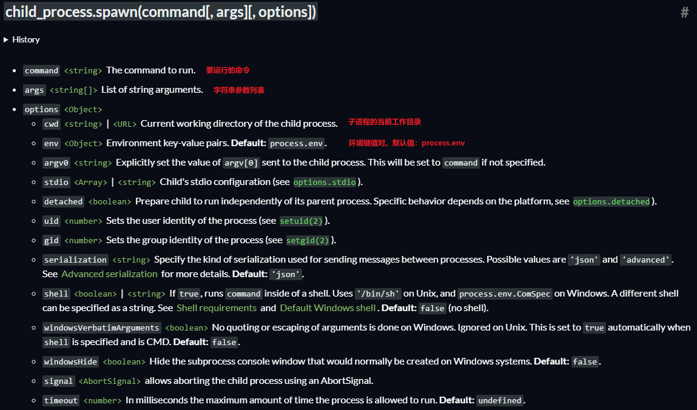
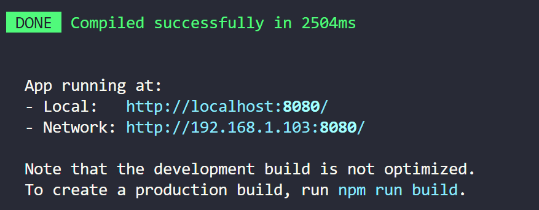

# 开发一个脚手架

## 为什么开发脚手架

这种东西一般是在大公司用到的东西，小公司一般不会搞这种东西,那么大公司一般会怎么做呢？

一般大公司在开发vue项目或者react项目的时候，它一般不会是去从0开始去创建,我们如果要开发一个vue项目的时候，一般是用vue的脚手架

```js
vue create demo
```

用这种命令去创建一个vue的脚手架，用这种创建的项目，里面可能会有一些个性化的配置，不管是vuex，还是router这些东西,但是总体上来说它是一个最基本的项目，当然可以选择,当然就算你选择了这些东西，他依然没有帮你做一些配置，比如配置router，配置vuex，你只是可以引入,你通过这种方式创建的项目是一个非常非常基本的项目，是一个非常简单的项目

> - 第一：这个项目没有划分目录结构
>
> - 第二：里面没有进行基本的配置，例如vue.config.js（例如别名），没有axios或者fetch，没有就意味着你需要手动去安装，安装完了以后还需要封装和配置，如果做的事后台管理系统，可能会用element-ui或者antdesign，也需要单独安装或者配置，router的配置，比如router的实例配置等，vuex的配置也是没做的

总之你通过vue create demo这个命令生成的，它全都是没有帮你配置的，他只是一个最基本的项目，里面很多东西都是没有的，如果你是一个普通项目，普通的程序员思维开发时没有问题的，但是如果你是一个架构师的角度去考虑这个问题的话，我是认为你不应该这样考虑，你这个脚手架没有，那我能不能自己先写一个vue的模板，我的项目模板把这些东西都配好了，当然我会根据不同的项目组先把这些东西都配好了，因为不一定所有的项目组的内容都是一样的，不一定，也可能是差不多，但是是不一定的


## 开发脚手架的思路

总之我自己搞了一个项目配置，我把我写好的项目模板放到github上面，或者自己公司的git仓库中，总之用git来管理，现在我把这个东西放到了仓库里面，放到仓库之后怎么做呢，我之后会告诉我所有的项目组员，你们以后创建项目不要使用`vue create name`来创建了，你现在直接去安装一个工具，比如这个工具放到了registry仓库里面

比如说我开发了一个工具叫做coderwhy，这个工具就跟webpack工具，就跟gulp工具一样，他就是一个终端的命令，他可以执行很多很多的东西，那么我就会开发这样一个工具，开发完了以后，我就会告诉我的组员，你们现在的话，全部去安装这样一个工具，开发完这个工具之后，让世界上所有的人，你去安装一下这个工具，那你这个工具怎么安装呢？

通过  ```npm install coderwhy -g``` 这样安装就行了，安装完了之后你就可以在你的命令终端敲一个命令

```
coderwhy create [casename]
```

当然这个create是需要自己定义的，后面将create怎么定义

一旦创建了这个东西，我就会从我的代码仓库中把我的代码下载到当前的目录中，下载到当前目录中我就会帮你做一些事情，帮你做什么事情呢，帮你安装项目中所有的依赖，当然默认情况下vue会帮你安装依赖，但是我这里也会帮你安装依赖，安装完依赖之后，自动打开浏览器，这些操作我都帮你做，但是呢，你只需要执行这样一个命令就可以了


那么项目中的所有配置都有了

当然你还可以对你的工具做一些扩展，比如帮你创建一个组件，帮你创建一个路由，甚至帮你创建一个vuex中的一个store，我只需要通过一个命令帮你来做就可以了


当然，可以不单单做vue的工具，我还可以对这个工具做一个扩展比如创建react项目等


> 总结一下就是：
>
> 1. 创建解析create指令 
> 2. 通过download-git-repo从代码仓库中下载模板 
> 3. 进入目录，并且执行 `npm install`命令 
> 4. 执行 `npm run serve`命令 
> 5. 打开浏览器

## coderwhy工具演练

### 安装coderwhy工具：全局安装

```javascript
npm install coderwhy -g
```

目前支持Vue，后期会支持React，Angular考虑中~

### vue项目模块已经帮你配置：

- 常用的目录结构（你可以在此基础上修改）
- vue.config.js（其中配置了别名，你可以自行修改和配置更多）
- axios（网络请求axios的安装以及二次封装）
- vue-router（router的安装和配置，另外有路由的动态加载，后面详细说明）
- vuex（vuex的安装和配置，另外有动态加载子模块，后面详细说明）

### 其他功能：

- 添加组件
- 添加页面和路由
- 添加vuex子模块

### 运行这个项目的过程

1. 安装工具

npm install coderwhy -g

2. 执行命令

coderwhy create demo

3. 项目自动启动了

要知道，vue或者react，本质上也是帮助你拉取了一个模板，并且帮你安装依赖，并且帮你启动过了, 执行上面的操作，我获得了这样一个文件夹


就可以发现，不需要从0去配置了，都已经配置好了

在这个里面是有配置两个路由的，一个是首页，一个是登录


home.vue是作为主页面的，里面有一个router.js就是它的路由


这里都已经写好了

如果想在上面继续开发的话，比如想创建一个组件, 可以这样


敲这个命令的话，就会自动创建一个组件


创建页面


动态加载router.js


创建store


## 创建项目

首先思考一个问题？

如何让我在终端写一些指令之后，给我显示一些东西

比如，上面的coderwhy --version的时候会出现一些版本号，coderwhy --help


怎么能让这个指令生效呢？


### 创建index.js

可以编写一些简单的代码

index.js

```js
console.log('Hello World')
```


### 创建package.json

执行`npm init -y` 生成`package.json`文件，并且修改入口文件，让我们执行的文件是我们创建的index.js文件

package.json

```json
{
  "name": "exerice",
  "version": "1.0.0",
  "description": "",
  "main": "index.js",
  "scripts": {
    "test": "echo \"Error: no test specified\" && exit 1"
  },
  "keywords": [],
  "author": "",
  "license": "ISC"
}
```

我们要做的是项目一旦启动，执行的就是index.js这个文件


### 执行index.js文件方案

#### 方案一：node index.js

我们平常要执行上面的`index.js`, 可能会这样做

```shell
node index.js
```

但是这样做，肯定不是我们想要的，因为是手动执行的啊，而且还需要在前面加个node，所以我们会有以下方案


### 创建自定义终端命令

入口文件中，添加如下指令（shebang也称为hashbang）

```js
#!/usr/bin/env node	
```

这种执行被称为`shebang`,它有什么作用呢？

就是当你执行某一个东西的时候，他如果找到了这个文件，他会根据shebang配置的环境，就是你在shebang后面可以配置一个环境，他会根据你这里配置的环境，然后去执行你当前的这个文件的，其实在很多其他语言哪里也有这么一个东西，比如在python里面，因为它的目的就是让你执行一个python脚本

因为我们这里写的是node, 那么我们这里怎么写呢？这个东西其实是固定的`env 环境 -> env node`

他写的是什么意思呢?

就是让你在你当前的电脑环境里面找一下node的一个指令，也就是找node的可执行文件，找到node可执行文件之后，就可以根据node， 这样一个可执行文件，用它来帮我们执行这个index.js它后续的所有代码，比如后面的console.log,所以这一行代码它是固定的，他就可以做到这一点了

> 当然你也可以写一个绝对路径，但是绝对路径在不同操作系统下面是不一样的，所以我们一般不会写绝对路径

index.js

```js
#!/usr/bin/env node	
console.log('Hello World')
```


这样写就可以了吗，不行，你还得告诉他你运行的指令叫什么名字,为了告诉他你还得配置一下


### 修改package.json

/package.json

```js
{
  "name": "exerice",
  "version": "1.0.0",
  "description": "",
  "main": "index.js",
  "bin": {
    "wts": "index.js"	// 告诉它我们执行wts指令的时候执行的文件
  },
  "scripts": {
    "test": "echo \"Error: no test specified\" && exit 1"
  },
  "keywords": [],
  "author": "",
  "license": "ISC"
}

```

在package.json里面配置一个bin，它是一个对象，然后配置一个键值对，key就是我们指令的名字，value就是当执行wts的时候执行什么文件

所以在这里，你一旦在这里跑的是wts的话，你执行的就是index.js这个文件

这个时候我们可以敲一个命令叫npm link 一旦敲了这个命令之后，他就会将这个命令和我们电脑的环境做一个链接，做一个链接之后，他就会将我们的wts作为一个终端命令配置到环境变量里面，因为只有在环境变量里面有这么一个命令之后，他才能找到这么一个命令，然后执行相应的文件


### npm link

在当前路径下执行`npm link`


这样就把我们的命令加到电脑的环境变量中了

#### 测试指令


可以发现，我们输入我们配置的指令之后，就能输出我们想要打印的东西了，它的流程就是我们通过`package.json`文件配置了一个bin的对象，这个对象中wts就是我们配置的指令，当我们配置了这个指令之后，我们输入这个指令，就能执行指令后面的代码了

> 注意：如果之前已经使用过这个命令了，那么按照提示，删除掉就行了

但是这些显然是不够的的，我还想敲wts给我显示版本号，但是我们只有这个


我们应该根据它不同的指令，最终显示的效果是不一样的

那么这个东西是怎么做呢？

这个东西难道我们是从0开始吗？

不是的，不管是vue的脚手架还是react的脚手架，这些脚手架也不是从0开始写的，它们都会使用一个第三方的库，这个库叫commander


### commander

#### 安装commander

```js
npm install commander
```


#### 认识commander

完整的nodejs命令行解决方案。

官网地址[commander官网](https://github.com/tj/commander.js/blob/master/Readme_zh-CN.md)


#### commander的基本演示


##### 参数处理

`配置 -> 解析 -> 获取 -> 打印 `

```js
const { program } = require('commander');

// 配置参数， 配置参数可以一个或者多个，逗号分隔
program
  .option('--wu, -W')

// 解析参数
program.parse();

// 获取参数
const options = program.opts();

// 打印参数，打印process中的参数
console.log('打印参数', options, process.argv);
```


> `options`第一个参数是字符串，在获取`options`的时候，这个字符串的最后一个配置的参数就是获取参数的值


##### 参数描述

```js
const { program } = require('commander');

// 配置参数， 配置参数可以一个或者多个，逗号分隔
program
  .option('--wu, -W', 'options description')

// 解析参数
program.parse();
```


##### 选项的默认值（默认值）

```js
const { program } = require('commander');

// 第一个值是参数，第二个值是描述，第三个值是默认值
program
  .option('-c, --cheese <type>', 'add the specified type of cheese', 'blue');

  program.parse();
  console.log(program.opts())
```


> 这个默认值有两种情况
>
> - 不带参数（如上）
> - 带参数，但是参数未配置，例如：`wts aaa`，执行这个命令，也是打印默认值


##### 获取参数

```js
const { program } = require('commander');
program
  .option('-c, --cheese <type>', 'add the specified type of cheese', 'blue');

program.parse();

// 获取命令配置
console.log(program.opts());

// 获取该命令配置传参
console.log(`cheese: ${program.opts().cheese}`);
```


##### .command

通过`.command()`可以配置命令，有两种实现方式：为命令绑定处理函数，或者将命令单独写成一个可执行文件（详述见后文）。

```js
// 通过绑定处理函数实现命令（这里的指令描述为放在`.command`中）
// 返回新生成的命令（即该子命令）以供继续配置
program
  .command('clone <source> [destination]')
  .description('clone a repository into a newly created directory')
  .action((source, destination) => {
    console.log('clone command called');
  });

```


#### 配置版本信息1

/index.js

```js
#!/usr/bin/env node

const program = require('commander');	//  引入这个库

program.version('1.0.0');	// 调用version函数，传入版本号
```

执行命令 `wts --version`


我们发现这里什么都没有打印

因为新版本的`commander`，如果需要它在命令行输出需要调用parse方法

/index.js

```js
#!/usr/bin/env node

const { program } = require('commander');
/**
 * 调用version函数，传入版本号
 * 调用parse方法在命令行输出
 */
program
  .version('2.0.1')
  .parse()
```

执行上面的代码后，输出


这里的版本号是写死的，我希望我的版本号能够跟随我的项目版本，输出对应的版本


#### 配置版本信息2

修改`package.json`中的`version`

```js
  "version": "2.2.2",
```

/index.js

```js
#!/usr/bin/env node

const { program } = require('commander');
/**
 * 调用version函数，传入版本号
 * 调用parse方法在命令行输出
 * require获取到package.json中的版本，传给了version方法
 */
program
  .version(require('./package.json').version)
  .parse()
```

执行 ↓


上面是通过 `--version`来获取版本号，通过这种方式来获取版本号，我们就可以智能的根据package.json中的版本号来输出我们的版本号

但是有时候我们在使用VUE或者其他命令的时候有时候还可以通过`-V`或者其他命令来获取版本号，那么这个能不能配置呢？


#### 配置版本信息3

配置命令行参数

/index.js

```js
#!/usr/bin/env node

const { program } = require('commander');
/**
 * 调用version函数，传入版本号
 * 调用parse方法在命令行输出
 * require获取到package.json中的版本，传给了version方法
 * version的第二个参数，配置在命令行中输入的参数，来获取版本信息
 */
program
  .version(require('./package.json').version, '-v, --version')
  .parse()
```

这样就可以通过 `wts -v`,或者 `wts --version`来获取版本信息，当然也可以配置更多的比如 `-a --a`等

上面的`-V, --version`会覆盖默认的`-V`，如果不想覆盖，可以这样写

/index.js

```js
const { program } = require('commander');

// 第一个是增加了 -V, --version
program.version(require('./package.json'));

// 第二个多增加了-v
program.version(require('./package.json'), '-v');
program.parse();
```


#### 配置help信息1

我们在别人的工具中，经常能看到 `xx --help`，能够输出一些信息，告诉使用者可以使用哪些命令，我们先来看看自己是否存在


可以看到，我们的`wts --help`也是可以输出一些信息的，这些是commander给我们配置的, 但是输出的信息比较少，那么我们是否可以配置一些其他东西呢？

答案是可以的


#### 配置help信息2

那`wts --help`呢？

`--help`输出的内容主要是根据配置了哪些东西，比如我们上面配置了版本号，那么我们再多配置一些

```js
const { program } = require('commander');

// 配置多个版本号命令
program
  .version(require('./package.json'), '-v, -V, --version')

program
  .option('-c, --cheese', 'cheese Description');
  
program.parse();
```



可以看到，`--help`打印的东西就多了


#### 配置options

我们在执行`wts --help`的时候会出现这些东西，这里有options，那么这些options是从哪里来呢？如果我想增加一些options应该怎么做呢？

`options`是什么意思呢？是增加一些可选的参数


这个-d就是一些可选的参数，也就是前面coderwhy的项目的一个配置

那这个可选的参数怎么定义呢？

```js
const { program } = require('commander');

// 增加自己的options
program
  .option('-c, --cheese', 'cheese Description');
  
program.parse();
```


可以看到，这里拿到了参数，这样就增加了一个option

但是你现在增加这个东西没什么太大的意义，因为现在增加这个东西，我们真正不会用这个东西，那有意义的是比如刚才增加一个-d,然后跟上一个真实的目录，并且在某一个地方获取到这个目录，说白了，就是这个option，我们想给他传一些参数，然后拿到这个参数

```js
const { program } = require('commander');

// 参数这样写是必填的
program.option('-d, --dest <dest>', 'a destination folder, 例如 -d src/components')

program.parse();

const options = program.opts();
console.log('options:', options)
console.log('process.argv:', process.argv);
```

打印结果


我们可以根据参数做不同的事情


> 这里的-f -w -d --dest都是自定义的，通过监听传过来的参数，做不同的事情


#### 监听--help

当然，还可以监听某一个指令

```js
const { program } = require('commander');

program.on('--help', function () {
  console.log('监听help命令');
})
// 参数这样写是必填的
program.option('-d, --dest <dest>', 'a destination folder, 例如 -d src/components')
program.parse();
```


### 划分目录/封装独立文件

这么多代码肯定不会只写到一个文件里面，肯定要对他们做一个封装的，封装到单独的文件就要对这个目录结构做一个划分了，之后可能不只是这些代码，还会有其他的了


#### 目录树

```js
│  index.js
│  package-lock.json
│  package.json
│
├─lib
│  ├─core
│  │      help.js
│  │
│  └─util
└─node_modules
    │  .package-lock.json
    │
    └─commander
```


#### 封装help

/lib/core/help.js

```js
const { program } = require('commander');
const helpOptions = () => {
  program.option('-W --wts', 'a wts cli');
  program.option('-D --dest <dest>', 'a destination folder, 例如： -d /src/components');
  program.on('--help', function () {
    console.log('');
    console.log('other:');
    console.log(' other options~');
  })
  return program;
}

module.exports = helpOptions;

```


#### 运行封装完的help

这样封装完，引入，并跑一下

/index.js

```js
#!/usr/bin/env node

const { program } = require('commander');
const helpOptions = require('./lib/core/help');

// 获取版本
program.version(require('./package.json').version);

// 帮助信息
const programInstance = helpOptions(program);

// 解析终端命令
program.parse(program.argv);

const options = programInstance.opts();
console.log(options);
```



也是可以的


### 监听create命令

那接下来要做什么事情呢？

就是我敲 `why create demo`

敲这个命令要做什么事情呢？就是先从`github`上面把代码下载到本地，然后还要在项目里面执行一个命令是`npm install`,然后还要打开浏览器  `npm run serve`

创建一个create文件

/lib/core/create.js

```js
const program = require('commander');
const createCommands = () => {
  program
    .command('create <project> [others...]')	// 创建指令的， [others...]可选的
    .description('clone repository into a folder')	// 描述
    .action((project, others) => {
      console.log('参数', project, others);
    })
}

module.exports = createCommands
```

然后在index.js中使用

/index.js

```js
#!/usr/bin/env node

const { program } = require('commander');
const helpOptions = require('./lib/core/help');
const createCommands = require('./lib/core/create');

// 获取版本
program.version(require('./package.json').version);

// 帮助信息
const programInstance = helpOptions(program);

// 创建一个指令
createCommands();

program.parse(program.argv);

const options = programInstance.opts();
console.log(options);
```

这个时候就打印了我们的参数


### 配置封装文件

我们在监听到命令之后，就可以去github上面clone这个项目，然后把他放到demo这个文件夹中

 创建一个actions文件夹用来写一些指令，因为我们的指令可能有很多，所以我们以后对所有的指令的操作都可以放到这个文件中

/lib/core/actions.js

```js
const createProjectAction = (project， others) => {

}
module.exports = {
  createProjectAction
};
```


在`create.js`中引入`actions`

/lib/core/create.js

```js
const program = require('commander');
const {
  createProjectAction
} = require('./actions');
// 创建指令
const createCommands = () => {
  // 创建脚手架
  program
    .command('create <project> [others...]')
    .description('clone repository into a folder')
    .action(createProjectAction)
}

module.exports = createCommands
```

> 我们要在`actions.js`中做这么几件事
>
> 1. clone项目
> 2. 执行 `npm install`
> 3. 运行 `npm run serve`
> 4. 打开项目


## clone项目

怎么在我的项目把他的代码下载下来呢？

### download-git-repo

#### 是什么

[download-git-repo](https://www.npmjs.com/package/download-git-repo)是用来克隆git上面的项目的,这个项目没有git地址了，它放到了gitlab里面，所以在git上搜不到是正常的，而且vue的cli也是用的这个东西的


#### 下载download-git-repo


```js
npm install download-git-repo
```


#### 官网示例



> - 第一个参数表示下载的地址
> - 第二参数表示下载后放的文件夹
> - 第三个参数是成功或失败的回到函数
> - 如果我们需要在成功之后做一些事情的话，就要在回调函数里面嵌套回调函数，这样如果嵌套的多了的话就会形成回调地狱，
> - 所以我们可以用node的一个内置库 util来把他转成promise，这样的话我们就可以写成同步的代码了


#### promisify

/lib/core/actions.js

```js
/**
   * 可以将回调函数转成promise形式
   * 它内部的原理其实就是将整段代码包了层promise
   * 等promise拿到结果之后， 他会看你有没有err
   * 如果有err, 就会调外层promise的reject
   * 如果没有err的话就调resolve
   */
const { promisify } = require('util');
const download = promisify(require('download-git-repo'));
/** 
    * 继续把他转成aysnc await的形式,整体是
    * callback -> promisify(函数) -> promise -> async await 	
    */
const createProjectAction = async (project) => {
    /**
     * 1. clone项目
     *  clone项目要用到库 download-git-repo
     *  但是现在这个项目没有git地址
     *  他放到了gitlab里面
     */
    await download();
    /**
     * 2. 执行npm install
     * 3. 运行 npm run serve
     * 4. 打开浏览器
     */
}
module.exports = {
  createProjectAction
};
```


因为将来别人可能不下载我这个git地址，可能用自己的git地址，那么我们就可以配置一个re-config文件


#### 配置download-git-repo

/lib/congif/repo-config.js

```js
// 这里的地址有很多种写法
const vueRepo = 'direct:https://github.com/coderwhy/hy-vue-temp.git';
module.exports = {
  vueRepo
}
```

> 这里的地址有很多种写法，但是我们一般都是通过http来获取的，所以我们要按照上面这种写法，官网有介绍


然后我们在下载项目那部分导入

```js

const { promisify } = require('util');
   /**
   * 可以将回调函数转成promise形式
   * 它内部的原理其实就是将整段代码包了层promise
   * 等promise拿到结果之后， 他会看你有没有err
   * 如果有err, 就会调外层promise的reject
   * 如果没有err的话就调resolve
   */
const download = promisify(require('download-git-repo'));

const { vueRep } = require('../config/repo-config');

	/** 
    * 继续把他转成aysnc await的形式,整体是
    * callback -> promisify(函数) -> promise -> async await 	
    */
const createProjectAction = async (project) => {
    /**
     * 1. clone项目
     *  clone项目要用到库 download-git-repo
     *  但是现在这个项目没有git地址
     *  他放到了gitlab里面
     * 2. 执行npm install
     * 3. 运行 npm run serve
     * 4. 打开浏览器
     */
    /**
      * 1. clone项目
      *  clone项目要用到库 download-git-repo
      *  但是现在这个项目没有git地址
      *  他放到了gitlab里面
      */
    //  参数一：下载地址，参数二：下载放到哪个文件夹， 参数三：要不要做一个克隆(创建一个git)
    await download(vueRep, project, {clone: true});
}
module.exports = {
  createProjectAction
};
```

>我们的createProjectAction是一个promise，注意actions是可以接收promise的
>
>/lib/core/create.js
>
>```js
>const program = require('commander');
>const {
>  createProjectAction
>} = require('./actions');
>const createCommands = () => {
>  program
>    .command('create <project> [others...]')
>    .description('clone repository into a folder')
>    // createProjectAction是一个promise，action可以接收一个promise
>    .action(createProjectAction)
>}
>
>module.exports = createCommands
>
>```


### 测试clone项目

命令行

```js
$ wts create demo
project demo
options {}
```

执行以后，就可以将项目克隆下来了




### 当前目录结构

```js
cli
├── index.js
├── lib
│   ├── config
│   │   └── repo-config.js
│   ├── core
│   │   ├── actions.js
│   │   ├── create.js
│   │   └── help.js
│   └── util
├── package-lock.json
└── package.json
```

> `index.js`是入口文件
>
> `lib`文件夹装着两个文件夹，一个是`confg`文件内部的`repo-config.js`，这个文件写的是clone的地址。
>
> `core`装着我们配置的文件
>
> ​	`actions.js`写的是我们的每一个指令要做的事，比如，clone文件等等
>
> ​	`create.js`是用来创建脚手架的配置，会引入`actions.js`
>
> `util`是我们的装着方法，暂时没有任何东西
>
> 


## 安装依赖

安装依赖的命令是`npm install`， 我们一般会在终端用这个命令来安装依赖，但是在程序里面我们如何让它来帮我们来安装呢？又因为可能接下来还会有其他的终端命令，比如 `npm run serve`，所以我们可能会对终端命令做一个封装


### 封装命令函数

/util/terminal.js

```js
空
```


### child_process模块

#### 是什么

它是node的一个模块，翻译过来叫子进程，一旦使用这个模块的东西的话，他会开启另外一个进程的，为什么要开启另外一个进程呢？因为我们如果想让他执行另外一个终端命令的话，是需要放到另外一个进程中的。

> 其实 我们在终端中执行一些命令操作，比如`npm install`，都是在另外一个进程做我们相关的任务的

所以这次我们也是需要开启一个进程的，开启进程我们就需要用到`child_process`模块中的两个东西 


#### exec和spawn

`exec`, `spawn`， 这两个东西都是可以开启子的，有什么区别呢？

`exec`是对`spawn`做了一个封装，`exec`用起来会更方便，`spawn`用起来会更底层一点

这里使用的是`spawn`

导入`spawn`

/util/terminal.js

```js
// 封装终端命令相关的代码

const { exec, spawn } = require('child_process'); 
module.exports = {
    spawn
}
```

导入它之后就可以利用他来帮我执行一些子进程


### 开启子进程执行终端命令

接下来我们就需要利用spawn来开启子进程来执行一些终端命令了，比如帮我们执行`npm install`等等，那让他执行什么样的命令，肯定取决于我们给他如何传参，[官网](https://nodejs.org/docs/latest-v16.x/api/child_process.html#child_processspawncommand-args-options)有说到



>`childProcess`这个进程中会有很多执行命令的过程中的打印信息，但是这些信息是属于childProcess这个进程的
>
>属于这个进程的话，这些信息在另外一个进程（也就是我们使用 `wts create demo`这个进程）是不会不会打印`childProcess`这个进程的信息的， 它只会在我们新开启的进程进行打印，也就意味着用户看不到它安装的进程，但是我们希望用户能看到
>
>在我们的进程里面会有一个流，叫`stdout`，叫`标准输出流`，上面返回的`childProcess`有一个属性，这个属性就是`stdout`，有这个属性之后我们就可以通过这个输出流来在`wts create demo`这个子进程中拿到新开启的进程中的一些信息，`stdout`有一个属性叫`pipe（管道）`，它是一个函数，我们可以通过这个管道函数把他所有的东西放到`process`，这个`process`指的就是我们的全局对象，它代表的是我们的当前进程(`wts create demo`这个进程)，可以把输出流里面所有的东西放到我的`stdout`里面，就意味着把新开启的进程的输出流放到当前进程的输出流里面，这样控制台就可以打印新开启的输出流的信息了
>
>当前进程：在输入 `wts create demo`的命令行的进程
>
>新开启的进程：利用`child_procee`帮我们开启的进程
>
>

知道这个之后，我们就可以这样做了


/util/terminal.js

```js
// 封装终端命令相关的代码

const { exec, spawn } = require('child_process');
// 要开启新的进程，需要把新开启的进程按照上面官网的参数传给我，下面会调用spawn开启进程
const commandSpawn = (...args) => {
  // spawn调用完了以后，会返回这个进程，这个进程里有一些信息
  const childProcess = spawn(...args);

  // 将childProcess这个进程的输出放到当前进程的输出
  childProcess.stdout.pipe(process.stdout);
  childProcess.stderr.pipe(process.stderr);

}
```

接下来，我们需要知道它什么时候执行完了，比如`npm install`执行完了，我之后我们可能想要 `npm run serve`，所以我们需要监听childProcess进程

/lib/terminal.js

```js
// 封装终端命令相关的代码

const { exec, spawn } = require('child_process');
// 要开启新的进程，需要把新开启的进程按照上面官网的参数传给我，下面会调用spawn开启进程
const commandSpawn = (...args) => {
  // spawn调用完了以后，会返回这个进程，这个进程里有一些信息
  const childProcess = spawn(...args);

  // 将childProcess这个进程的输出放到当前进程的输出
  childProcess.stdout.pipe(process.stdout);
  childProcess.stderr.pipe(process.stderr);

  // 监听childProcess这个进程的关闭，如果关闭了意味着它执行完了，那么我们就可以做其他操作了
  childProcess.on('close', () => {})
}
```

在调用这个函数之后，我们想要知道这个函数完了，我们可以使用promise来做到，所以封装一下promise

/lib/terminal.js

```js
// 封装终端命令相关的代码

const { exec, spawn } = require('child_process');
// 要开启新的进程，需要把新开启的进程按照上面官网的参数传给我，下面会调用spawn开启进程
const commandSpawn = (...args) => {
  return new Promise((resolve, reject) => {
    // spawn调用完了以后，会返回这个进程，这个进程里有一些信息
    const childProcess = spawn(...args);

    // 将childProcess这个进程的输出放到当前进程的输出
    childProcess.stdout.pipe(process.stdout);
    childProcess.stderr.pipe(process.stderr);

    // 监听childProcess这个进程的关闭，如果关闭了意味着它执行完了，那么我们就可以做其他操作了
    childProcess.on('close', () => {
      console.log('管道关闭')
      resolve();
    })
  })

}
module.exports = {
  commandSpawn
}
```

这样在外层就可以通过await拿到结果了，或者利用await阻塞代码的执行

引入terminal.js

/lib/core/actions.js

```js

const { promisify } = require('util');

const download = promisify(require('download-git-repo'));

const { vueRepo } = require('../config/repo-config');
const { commandSpawn } = require('../util/terminal');

  /**
   * 可以将回调函数转成promise形式
   * 它内部的原理其实就是将整段代码包了层promise
   * 等promise拿到结果之后， 他会看你有没有err
   * 如果有err, 就会调外层promise的reject
   * 如果没有err的话就调resolve
   */
  const createProjectAction = async (project) => {
    console.log('project', project);
    /**
     * 1. clone项目
     *  clone项目要用到库 download-git-repo
     *  但是现在这个项目没有git地址
     *  他放到了gitlab里面
     * 2. 执行npm install
     * 3. 运行 npm run serve
     * 4. 打开浏览器
     */
    /**
      * 1. clone项目
      *  clone项目要用到库 download-git-repo
      *  但是现在这个项目没有git地址
      *  他放到了gitlab里面
      */
    //  参数一：下载地址，参数二：下载放到哪个文件夹， 参数三：要不要做一个克隆(创建一个git)
     await download(vueRepo, project, {clone: true});

    //  2. 执行npm install
    //  下载依赖：参数1，执行的是npm命令，参数2，执行的是install，参数3，进入到目录
    await commandSpawn('npm', ['install'], {cwd: `./${project}`})
  }
module.exports = {
  createProjectAction
};
```


### 测试自动下载 npm install

```js
wts create demo
```

执行这个命令我们得到这个结果

```js
$ wts create demo1
project demo1
options {}
node:events:505
      throw er; // Unhandled 'error' event
      ^

Error: spawn npm ENOENT
    at Process.ChildProcess._handle.onexit (node:internal/child_process:283:19)
    at onErrorNT (node:internal/child_process:478:16)
    at processTicksAndRejections (node:internal/process/task_queues:83:21)
Emitted 'error' event on ChildProcess instance at:
    at Process.ChildProcess._handle.onexit (node:internal/child_process:289:12)
    at onErrorNT (node:internal/child_process:478:16)
    at processTicksAndRejections (node:internal/process/task_queues:83:21) {
  errno: -4058,
  code: 'ENOENT',
  syscall: 'spawn npm',
  path: 'npm',
  spawnargs: [ 'install' ]
}
```

可以发现报错了

#### window电脑执行npm的指令

> 在window上`npm install` 并不叫做`npm`, 它本质上执行的是`npm.cmd`， 我们平常在电脑上执行的`npm install` 实际上window会帮助我们执行`npm.cmd install`，我们自己在命令行执行`npm`的时候，window会帮助我们加上`.cmd`，但是在我们自己创建的进程上，它是不会帮助我们加上`.cmd`的，`where webpack`可以找到`webpack`这个文件和文件夹，但是它还有一个`webpack.cmd`文件实际上window电脑帮助我们执行的是`webpack.cmd`这个文件，所以不能写死的，不然不能跨平台

我们需要修改actions.js

/lib/actions.js

```js

const { promisify } = require('util');

const download = promisify(require('download-git-repo'));

const { vueRepo } = require('../config/repo-config');
const { commandSpawn } = require('../util/terminal');

  /**
   * 可以将回调函数转成promise形式
   * 它内部的原理其实就是将整段代码包了层promise
   * 等promise拿到结果之后， 他会看你有没有err
   * 如果有err, 就会调外层promise的reject
   * 如果没有err的话就调resolve
   */
  const createProjectAction = async (project) => {
    console.log('项目创建中...');
    /**
     * 1. clone项目
     *  clone项目要用到库 download-git-repo
     *  但是现在这个项目没有git地址
     *  他放到了gitlab里面
     * 2. 执行npm install
     * 3. 运行 npm run serve
     * 4. 打开浏览器
     */
    /**
      * 1. clone项目
      *  clone项目要用到库 download-git-repo
      *  但是现在这个项目没有git地址
      *  他放到了gitlab里面
      */
    //  参数一：下载地址，参数二：下载放到哪个文件夹， 参数三：要不要做一个克隆(创建一个git)
     await download(vueRepo, project, {clone: true});

    //  2. 执行npm install
    //  下载依赖：参数1，执行的是npm命令，参数2，执行的是install，参数3，进入到目录
    const command = process.platform === 'win32' ? 'npm.cmd' : 'npm';
    await commandSpawn(command, ['install'], {cwd: `./${project}`})
  }
module.exports = {
  createProjectAction
};
```

```js
wts create demo_1
```


这样就可以下载依赖了，并且日志也可有有输出了


### 运行npm run serve

运行`npm run serve`这个终端命令的话，我们依然需要node帮我们开启一个进程来执行这个命令，所以依然调用这个方法

/lib/create.js

```js

const { promisify } = require('util');

const download = promisify(require('download-git-repo'));

const { vueRepo } = require('../config/repo-config');
const { commandSpawn } = require('../util/terminal');

  /**
   * 可以将回调函数转成promise形式
   * 它内部的原理其实就是将整段代码包了层promise
   * 等promise拿到结果之后， 他会看你有没有err
   * 如果有err, 就会调外层promise的reject
   * 如果没有err的话就调resolve
   */
  const createProjectAction = async (project) => {
    console.log('项目创建中...');
    /**
     * 1. clone项目
     *  clone项目要用到库 download-git-repo
     *  但是现在这个项目没有git地址
     *  他放到了gitlab里面
     * 2. 执行npm install
     * 3. 运行 npm run serve
     * 4. 打开浏览器
     */
    /**
      * 1. clone项目
      *  clone项目要用到库 download-git-repo
      *  但是现在这个项目没有git地址
      *  他放到了gitlab里面
      */
    //  参数一：下载地址，参数二：下载放到哪个文件夹， 参数三：要不要做一个克隆(创建一个git)
     await download(vueRepo, project, {clone: true});

    //  2. 执行npm install
    //  下载依赖：参数1，执行的是npm命令，参数2，执行的是install，参数3，进入到目录
    const command = process.platform === 'win32' ? 'npm.cmd' : 'npm';
    await commandSpawn(command, ['install'], {cwd: `./${project}`})

    // 3. 运行 npm run serve
    await commandSpawn(command, ['run', 'serve'], {cwd: `./${project}`})
  }
module.exports = {
  createProjectAction
};
```

执行`wts create demo_1`


### 打开浏览器

#### 方案一

需要下载一个第三方库 `open`

`open`这个库最主要的功能就是帮助我们打开浏览器的

下载

```js
npm install open
```


/lib/create.js

```js

	...
    
    const createProjectAction = async (project) => {

      ...
        
      // 3. 运行 npm run serve
      await commandSpawn(command, ['run', 'serve'], {cwd: `./${project}`})
        
      // 4. 打开浏览器
      open('http://localhost:8000')
    }
```

如果我们这样写的话，他实际上并不会帮助我们默认打开的，因为npm run serve在我们的子进程里面不会结束



他不会结束，那么就说明他做了一个阻塞，做了阻塞，也就是说

/lib/util/terminal.js

```js
// 封装终端命令相关的代码

const { exec, spawn } = require('child_process');
// 要开启新的进程，需要把新开启的进程按照上面官网的参数传给我，下面会调用spawn开启进程
const commandSpawn = (...args) => {
  return new Promise((resolve, reject) => {
    // spawn调用完了以后，会返回这个进程，这个进程里有一些信息
    const childProcess = spawn(...args);

    // 将childProcess这个进程的输出放到当前进程的输出
    childProcess.stdout.pipe(process.stdout);
    childProcess.stderr.pipe(process.stderr);

    // 监听childProcess这个进程的关闭，如果关闭了意味着它执行完了，那么我们就可以做其他操作了
    childProcess.on('close', () => {
      console.log('管道关闭')
      resolve();
    })
  })

}
module.exports = {
  commandSpawn
}
```

这里的代码中的`resolve`是不会调用的，因为这个管道并没有关闭，所以我们不能在`npm run serve`的时候用await把它阻塞住，这样就会造成我们先打开浏览器，后项目才会启动，但是这样也没有问题，因为浏览器会进行一个热更新

/lib/actions.js

```js
	...
    // 3. 运行 npm run serve
    commandSpawn(command, ['run', 'serve'], {cwd: `./${project}`})

    // 4. 打开浏览器
    open('http://localhost:8000')
```


#### 方案二

注意：open从9.0.0开始不支持commanjs了，如果想用open可以下载9一下的版本，另一种方案就是这样

/lib/actions.js

```js
const { promisify } = require('util');
const { exec } = require('child_process');

const download = promisify(require('download-git-repo'));


// 3. 运行 npm run serve
commandSpawn(command, ['run', 'serve'], { cwd: `./${project}` })

// 4. 打开浏览器
exec('http://localhost:8000')
}
```


这样我们就做到了上面说的那些功能了。


### 改变打印的颜色

我们一般在创建脚手架的时候可能会有一些文字，比如 `脚手架创建中`，如果想给他加一些颜色，可以用一个库`chalk`


### vue的脚手架

vue的架手架大概的原理也是上面这样，地址在[这里](https://github.com/vuejs/vue-cli)


## 添加组件

> 创建组件，先要有一个组件的模板，有了这个模板，根据它要创建的组件，去生成一个`.vue`的文件，那模板要用什么生成呢？前端用的最多的是`ejs`，所以我们要用`ejs`生成模板，然后转成`.vue`文件，然后把它写入到`dest(目标目录)`中
>
> 总结一下就是
>
> 1. 有对应的ejs模板
> 2. 编译`ejs`模板，拿到resutl结果
> 3. 把result写入到文件中
> 4. 放到对应的文件夹中


### 创建ejs文件

因为我们要创建模板，模板可能有很多，所以我们要创建一些文件夹或者文件，生成目录

```js
exerice
├── index.js
├── lib
│   ├── config
│   │   └── repo-config.js
│   ├── core
│   │   ├── actions.js
│   │   ├── create.js
│   │   └── help.js
│   ├── templates
│   │   └── vue-component.ejs
│   └── util
│       └── terminal.js
├── package-lock.json
└── package.json
```

可以看到我们创建了 `templates`文件夹和`component.vue.ejs`文件，接下来我们要编辑ejs文件，首先[ejs语法](https://ejs.bootcss.com/)有很多


### 编辑ejs文件

我们想要生成的ejs文件可能是这样

/lib/templates/vue-component.ejs

```js
<template>
  <div class="hello-world">
    <h1>{{ msg }}</h1>
  </div>
</template>

<script>
export default {
  name: "HelloWorld",
  data: function () {
    return {
      message: "Hello World",
    };
  },
  mixins: [],
  props: {
    msg: String,
  },
  components: {},
  computed: {},
  methods: {},
};
</script>

<style>
.hello-world {
}
</style>
```

但是有一个问题就是，这里的hello-world是写死的，也就是每次生成的模板都是这样。

所以我们要给ejs传参，当我们拿到参数以后，我们把参数放到模板里面，让它根据参数来生成不同的模板

### ejs传参

所以在ejs中，我们要拿到参数，并且根据不同的参数，修改不同地方的内容

/lib/templates/vue-component.ejs

```js

<template>
  <!-- 这里是ejs的语法，data.lowerName是将传过来的参数转成小写 -->
  <div class="<%= data.lowerName %>">
    <h1>{{ msg }}</h1>
  </div>
</template>

<script>
export default {
  name: "<%= data.name%>",
  data: function () {
    return {
      message: "<% data.name %>",
    };
  },
  mixins: [],
  props: {
    msg: String,
  },
  components: {},
  computed: {},
  methods: {},
};
</script>

<style>
.<%= data.lowerName %> {
}
</style>
```

这样就能动态的生成模板了


### 创建ejs其他模板

/lib/templates/vue-router.ejs

```js
// 普通加载路由
// import <%= data.name %> from './<%= data.name %>.vue'
// 懒加载路由
const <%= data.name %> = () => import('./<%= data.name %>.vue')
export default {
  path: '/<%= data.lowerName %>',
  name: '<%= data.name %>',
  component: <%= data.name %>,
  children: [
  ]
}

```


/lib/templates/vue-store.ejs

```js
import * as types from './types.js'
export default {
  namespaced: true,
  state: {
  },
  mutations: {
  },
  actions: {
  },
  getters: {
  }
}

```


/lib/templates/vue-types.ejs

```js
export {
  
}
```


### 新的目录结构

```js
exerice
├── index.js
├── lib
│   ├── config
│   │   └── repo-config.js
│   ├── core
│   │   ├── actions.js
│   │   ├── create.js
│   │   └── help.js
│   ├── templates
│   │   ├── vue-component.ejs
│   │   ├── vue-router.ejs
│   │   ├── vue-store.ejs
│   │   └── vue-types.ejs
│   └── util
│       └── terminal.js
├── package-lock.json
└── package.json
```

模板已经好了，我们可以先写一个指令函数，也就是action


### 新增创建组件的指令

/lib/core/actions.js

```js

const { promisify } = require('util');
const { exec } = require('child_process');

const download = promisify(require('download-git-repo'));
const chalk = require('chalk');

const { vueRepo } = require('../config/repo-config');
const { commandSpawn } = require('../util/terminal');

/**
 * 可以将回调函数转成promise形式
 * 它内部的原理其实就是将整段代码包了层promise
 * 等promise拿到结果之后， 他会看你有没有err
 * 如果有err, 就会调外层promise的reject
 * 如果没有err的话就调resolve
 */
const createProjectAction = async (project) => {
  console.log(chalk.blue('项目创建中...'));
  /**
   * 1. clone项目
   *  clone项目要用到库 download-git-repo
   *  但是现在这个项目没有git地址
   *  他放到了gitlab里面
   * 2. 执行npm install
   * 3. 运行 npm run serve
   * 4. 打开浏览器
   */
  /**
    * 1. clone项目
    *  clone项目要用到库 download-git-repo
    *  但是现在这个项目没有git地址
    *  他放到了gitlab里面
    */
  //  参数一：下载地址，参数二：下载放到哪个文件夹， 参数三：要不要做一个克隆(创建一个git)
  await download(vueRepo, project, { clone: true });

  //  2. 执行npm install
  //  下载依赖：参数1，执行的是npm命令，参数2，执行的是install，参数3，进入到目录
  const command = process.platform === 'win32' ? 'npm.cmd' : 'npm';
  await commandSpawn(command, ['install'], { cwd: `./${project}` })

  // 3. 运行 npm run serve
  commandSpawn(command, ['run', 'serve'], { cwd: `./${project}` })

  // 4. 打开浏览器
  exec('http://localhost:8000')
}

// 添加组件的action,name: 创建的名字，dest：创建的目标目录
const addComponentAction = (name, dest) => {
  
}

module.exports = {
  createProjectAction,
  addComponentAction
};
```

引入这个actions去执行

/lib/core/create.js

```js
const program = require('commander');
const {
  createProjectAction
} = require('./actions');
const createCommands = () => {
  // 创建脚手架
  program
    .command('create <project> [others...]')
    .description('clone repository into a folder')
    // createProjectAction是一个promise，action可以接收一个promise
    .action(createProjectAction)

  // 创建组件
  program
  .command('addCpn <name> [others...]')
  .description('add vue component, 例如： wts addCpn HelloWorld -d src/components')
  .action(addComponentAction)
}

module.exports = createCommands
```


接下来我们需要编译我们的模板

### 编译模板

#### 封装编译模板函数

/lib/util/util.js

```js
// 参数一：需要编译的模板，参数二：传给模板的参数
const compile = (template, data) => {

}
```

要编译模板的话需要用到一个库

#### 编译模板的第三方库

这个库叫做ejs

下载ejs

```js
npm install ejs
```

ejs的[地址](https://github.com/mde/ejs)

/lib/util/util.js

```js
const ejs = require('ejs');
const path = require('path');
// 参数一：需要编译的模板，参数二：传给模板的参数
const compile = (templateName, data) => {
  const templatePosition = `../templates/${templateName}`;
  const templatePath = path.resolve(__dirname, templatePosition);
  console.log(templatePath);
  return new Promise((resolve, reject) => {
    // 参数一：绝对路径, 参数二：给ejs传的数据, 参数三：可传可不传，参数四：回调函数
    ejs.renderFile(templatePath, { data }, {}, (err, result) => {
      // 如果有错误，我们打印错误，如果没有错误，我们把编译的结果resolve出去
      if (err) {
        console.log(err);
        reject(err);
        return;
      }
      resolve(result);
    })
  })
}

module.exports = {
  compile
}
```

> 这个就是编译的过程，要注意前面是找到编译的ejs的路径，把路径传给ejs了


把编译ejs的方法在action中引入

/lib/core/actions.js

```js

const { promisify } = require('util');
const { exec } = require('child_process');

const download = promisify(require('download-git-repo'));
const chalk = require('chalk');

const { vueRepo } = require('../config/repo-config');
const { commandSpawn } = require('../util/terminal');

const { compile } = require('../util/util');

...

// 添加组件的action,name: 创建的名字，dest：创建的目标目录
const addComponentAction = async (name, dest) => {
  // 参数一：要编译的ejs模板名称，参数二：传递给ejs的参数
  const result = await compile('vue-component.ejs', {name, lowerName: name.toLowerCase()});
  console.log(result);
}

module.exports = {
  createProjectAction,
  addComponentAction
};
```

打印结果

```js
<template>
  <div class="xixi">
    <h1>{{ msg }}</h1>
  </div>
</template>

<script>
export default {
...
```


### 封装写入文件

因为我们将来可能有多个`ejs`都需要写入到文件中，所以我们最好封装一个方法来做这件事

/lib/util/util.js

```js
const fs = require('fs');

const ejs = require('ejs');
const path = require('path');

...

// 参数一：写入路径， 参数二，写入的内容
const writeToFile = (path, content) => {
  return fs.promises.writeFile(path, content)
}

module.exports = {
  compile,
  writeToFile
}
```


在`actions.js`中导

/lib/core/actions.js

```js

const { promisify } = require('util');
const path = require('path');
const { exec } = require('child_process');

const download = promisify(require('download-git-repo'));
const chalk = require('chalk');

const { vueRepo } = require('../config/repo-config');
const { commandSpawn } = require('../util/terminal');

const { compile, writeToFile } = require('../util/util');

...

// 添加组件的action,name: 创建的名字，dest：创建的目标目录
const addComponentAction = async (name, dest) => {
  // 参数一：要编译的ejs模板名称，参数二：传递给ejs的参数
  const result = await compile('vue-component.ejs', {name, lowerName: name.toLowerCase()});

  // 写入文件
  const targetPath = path.resolve(dest, `${name}.vue`);
  writeToFile(targetPath, result);
  console.log(result, targetPath);
}

module.exports = {
  createProjectAction,
  addComponentAction
};
```

```js
wts addCpn hell
```

报错了

这个时候虽然导入了，但是存在一个问题，就是dest这里我们是没有传值的，一方面我们在命令行没有传路径，另一方面，我们也没有默认路径，所以在`addComponentAction`这个函数中`dest`是`undefined`，也就报错了

/lib/core/create.js

```js
const program = require('commander');
const {
  createProjectAction,
  addComponentAction
} = require('./actions');
const createCommands = () => {
    
  ...
    
  // 创建组件
  program
  .command('addCpn <name>')
  .description('add vue component, 例如： wts addCpn HelloWorld -d src/components')
  .action(addComponentAction)
}

module.exports = createCommands

```


在coderwhy的cli中，是可以通过`why addcpn Swiper -d src/pages/home`这样传递参数来创建组件到指定的目录的，但是我们这里没有这个能力，那么我们添加这个能力

首先我们要知道我们曾经在创建`help`的时候有配置一个指令叫-D,我把这个文件拿出来

/lib/core/help.js

```js

const helpOptions = (program) => {
  program.option('-W --wts', 'a wts cli');
  program.option('-D --dest <dest>', 'a destination folder, 例如： -d /src/components');
  program.on('--help', function () {
    console.log('');
    console.log('other:');
    console.log(' other options~');
  })
  return program;
}

module.exports = helpOptions;

```

配置这个指令就意味着，我们在输入 -D 再加上一个参数之后我们是可以拿到这个参数的

```js
#!/usr/bin/env node

const { program } = require('commander');
const helpOptions = require('./lib/core/help');
const createCommands = require('./lib/core/create');

// 获取版本
program.version(require('./package.json').version);

// 帮助信息
const programInstance = helpOptions(program);

// 创建一个指令
// createCommands();

program.parse(program.argv);

const options = programInstance.opts();
console.log('options', options);
```

我们在这里测试一下能不能拿到，创建指令的代码暂时注释掉

打印结果：

```js
$ wts -d src/components
嘻嘻哟 { dest: 'src/components' }
```

发现确实可以拿到

所以，我们可以将这两个指令结合起来使用，那就是这个样子

/lib/core/create.js

```js
const {
  createProjectAction,
  addComponentAction
} = require('./actions');
// 这里必须拿到外层的program，这样才能是同一个program
const createCommands = (program) => {
  // 获取到所有的参数，也就获取到了 -d 后面的参数
  const options = program.opts();
    
  ...
    
  // 创建组件
  program
  .command('addCpn <name>')
  .description('add vue component, 例如： wts addCpn HelloWorld [-d src/components]')
  // 因为这里要传参，所以不能直接放在里面了,参数：name就是 wts addCpn name
  .action((name) => {
    const dest = options.dest ? options.dest : 'src/components';
    addComponentAction(name, dest);
  })
}

module.exports = createCommands

```


/index.js

```js
#!/usr/bin/env node

const { program } = require('commander');
const helpOptions = require('./lib/core/help');
const createCommands = require('./lib/core/create');

// 获取版本
program.version(require('./package.json').version);

// 帮助信息
const programInstance = helpOptions(program);

// 创建一个指令,这里要将program传进去
createCommands(program);

program.parse(program.argv);
```

运行一下

```js
wts addCpn cp -d src/components
```


发现没问题


### 添加page组件

/lib/core/actions.js

```js


const { promisify } = require('util');
const path = require('path');
const { exec } = require('child_process');

const download = promisify(require('download-git-repo'));
const chalk = require('chalk');

const { vueRepo } = require('../config/repo-config');
const { commandSpawn } = require('../util/terminal');

const { compile, writeToFile } = require('../util/util');

...

// 添加页面和路由
const addPageAndRouteAction = async (name, dest) => {
  // 1. 编译ejs模板
  const data = {name, lowerName: name.toLowerCase()}
  const pageResult = await compile('vue-component.ejs', data);
  const routeResult = await compile('vue-router.ejs', data);
  // 2. 写入文件
  const targetPagePath = path.resolve(dest, `${name}.vue`);
  // router.js是固定的名字
  const targetRoutePath = path.resolve(dest, `router.js`);
  console.log('路径是什么呢', targetPagePath)
  writeToFile(targetPagePath, pageResult);
  writeToFile(targetRoutePath, routeResult);
}

module.exports = {
  createProjectAction,
  addComponentAction,
  addPageAndRouteAction
};
```


/lib/core/create.js

```js
const {
  createProjectAction,
  addComponentAction,
  addPageAndRouteAction
} = require('./actions');
const createCommands = (program) => {
  const options = program.opts();

  // 创建页面
  program
    .command('addPage <page>')
    // 可选的 -d src/pages
    .description('add vue page and router config, 例如 addPage Home [-d src/pages]')
    .action((name) => {
      const dest = options.dest ? options.dest : 'src/pages';
      addPageAndRouteAction(name, dest);
    })
}

module.exports = createCommands
```

但是这样做发现不行，因为我们创建的页面，他外层是有一个同名的文件夹的， 所以我们需要创建这样一个文件夹，但是创建文件夹需要递归创建


#### 封装创建文件夹方法

/lib/util/utils.js

```js
const fs = require('fs');

const ejs = require('ejs');
const path = require('path');

...

// 递归创建文件夹
const createDirSync = (pathName) => {
  // existsSync是否存在这个文件夹
  if(fs.existsSync(pathName)) {
    return true;
  } else if (createDirSync(path.dirname(pathName))) {
    // path.dirname获取父文件夹名称
    fs.mkdirSync(pathName);
    return true;
  }
}


module.exports = {
  compile,
  writeToFile,
  createDirSync
}
```


我们要在写入文件前，先判断有没有这个文件夹，如果没有就通过上面的创建文件夹的方法来创建

/lib/core/actions.js

```js

const { promisify } = require('util');
const path = require('path');
const { exec } = require('child_process');

const download = promisify(require('download-git-repo'));
const chalk = require('chalk');

const { vueRepo } = require('../config/repo-config');
const { commandSpawn } = require('../util/terminal');

const { compile, writeToFile, createDirSync } = require('../util/util');

...

// 添加页面和路由
const addPageAndRouteAction = async (name, dest) => {
  // 1. 编译ejs模板
  const data = { name, lowerName: name.toLowerCase() }
  const pageResult = await compile('vue-component.ejs', data);
  const routeResult = await compile('vue-router.ejs', data);
  // 2. 写入文件，要等到创建成功之后再写入
  if (createDirSync(dest)) {
    const targetPagePath = path.resolve(dest, `${name}.vue`);
    // router.js是固定的名字
    const targetRoutePath = path.resolve(dest, `router.js`);
    writeToFile(targetPagePath, pageResult);
    writeToFile(targetRoutePath, routeResult);
  }
}

module.exports = {
  createProjectAction,
  addComponentAction,
  addPageAndRouteAction
};
```


默认存在一个文件夹是当前创建的名称，创建的两个文件是在这个文件夹里面的

/lib/core/create.js

```js
const {
  createProjectAction,
  addComponentAction,
  addPageAndRouteAction
} = require('./actions');
const createCommands = (program) => {
  const options = program.opts();
    
  ...

  // 创建页面
  program
    .command('addPage <page>')
    // 可选的 -d src/pages
    .description('add vue page and router config, 例如 addPage Home [-d src/pages]')
    .action((name) => {
      // 如果没有加参数，这里是默认路径
      const dest = options.dest ? options.dest : `src/pages/${name}`;
      addPageAndRouteAction(name, dest);
    })
}

module.exports = createCommands

```


那么测试一下

```js
$ wts addPage xixi -d source/wts
D:\studyMaterial\node\exerice\demo\demo_1\source\wts\xixi.vue
```


可以发现确实是有创建出来的


### 添加store

添加store的流程和添加页面/组件的流程相似，这里只给出代码

/lib/core/actions.js

```js

const { promisify } = require('util');
const path = require('path');
const { exec } = require('child_process');

const download = promisify(require('download-git-repo'));
const chalk = require('chalk');

const { vueRepo } = require('../config/repo-config');
const { commandSpawn } = require('../util/terminal');

const { compile, writeToFile, createDirSync } = require('../util/util');

...

// 添加store
const addStoreAction = async (name, dest) => {
  // 1. 编译ejs模板, store的ejs里面没有参数
  const storeResult = await compile('vue-store.ejs', {});
  const typesResult = await compile('vue-types.ejs', {});

  // 2. 写入文件，要等到创建成功之后再写入
  if (createDirSync(dest)) {
    const targetPagePath = path.resolve(dest, `${name}.js`);
    // types.js是固定的名字
    const targetRoutePath = path.resolve(dest, `types.js`);
    writeToFile(targetPagePath, storeResult);
    writeToFile(targetRoutePath, typesResult);
  }
}

module.exports = {
  createProjectAction,
  addComponentAction,
  addPageAndRouteAction,
  addStoreAction
};
```


/lib/core/create.js

```js
const {
  createProjectAction,
  addComponentAction,
  addPageAndRouteAction,
  addStoreAction
} = require('./actions');
const createCommands = (program) => {
  const options = program.opts();

  ...
    
  // 创建store
  program
    .command('addStore <name>')
    // 可选的 -d src/store/modules
    .description('add vue store config, 例如 addPage Home [-d src/store/modules]')
    .action((name) => {
      // 如果没有加参数，这里是默认路径
      const dest = options.dest ? options.dest : `src/store/modules/${name}`;
      addStoreAction(name, dest);
    })
}

module.exports = createCommands

```

执行起来也是没有问题的

到这里，所有的基本功能都已实现，所有的代码放在笔记最后。


## npm发布自己的包


那么怎么发布包呢


注册npm账号：

- https://www.npmjs.com/
- 选择sign up

在命令行登录：

```js
npm login
```

修改package.json

发布到npm registry上

```js
npm publish
```

更新仓库：

- 1.修改版本号(最好符合semver规范)
- 2.重新发布

删除发布的包：

```js
npm unpublish
```

让发布的包过期：

```js
npm deprecate
```


### 具体过程 


author: 开发人员

repository: 自己的仓库，这是都要填的


Homepage: 如果有自己的官网的话，可以填自己的官网，没有的话也是填github


keywords: 搜索关键字


比如这里写一些代码


首先要在npm的官网里面有账号


然后登录


发布自己的包


这样就发布好了


我们在npm看一下


这个就是我们填的

那么别人怎么用呢？

我们初始化一个package.json

然后安装这个包


引入这个包，调用这个包


如果想更新包呢？


这个时候要重新发布


这里就更新掉了


这里也更新了


## 创建脚手架笔记

### 目录结构

```js

exerice
├── index.js
├── lib
│   ├── config
│   │   └── repo-config.js
│   ├── core
│   │   ├── actions.js
│   │   ├── create.js
│   │   └── help.js
│   ├── templates
│   │   ├── vue-component.ejs
│   │   ├── vue-router.ejs
│   │   ├── vue-store.ejs
│   │   └── vue-types.ejs
│   └── util
│       ├── terminal.js
│       └── util.js
├── package-lock.json
├── package.json
└── node_modules
```


/package.json

```js
{
  "name": "exerice",
  "version": "2.2.2",
  "description": "",
  "main": "index.js",
  "bin": {
    "wts": "index.js"
  },
  "scripts": {
    "test": "echo \"Error: no test specified\" && exit 1"
  },
  "keywords": [],
  "author": "",
  "license": "ISC",
  "dependencies": {
    "chalk": "^4.1.2",
    "commander": "^9.5.0",
    "download-git-repo": "^3.0.2",
    "ejs": "^3.1.9",
    "open": "^9.0.0"
  }
}

```


/index.js

```js
#!/usr/bin/env node

const { program } = require('commander');
const helpOptions = require('./lib/core/help');
const createCommands = require('./lib/core/create');

// 获取版本
program.version(require('./package.json').version);

// 帮助信息
const programInstance = helpOptions(program);

// 创建一个指令
createCommands(program);

program.parse(program.argv);

const options = programInstance.opts();
```


/lib/core/help.js

```js

const helpOptions = (program) => {
  program.option('-W --wts', 'a wts cli');
  program.option('-d --dest <dest>', 'a destination folder, 例如： -d /src/components');
  program.on('--help', function () {
    console.log('');
    console.log('other:');
    console.log(' other options~');
  })
  return program;
}

module.exports = helpOptions;

```


/lib/core/create.js

```js
const {
  createProjectAction,
  addComponentAction,
  addPageAndRouteAction,
  addStoreAction
} = require('./actions');
const createCommands = (program) => {
  const options = program.opts();
  // 创建脚手架
  program
    .command('create <project> [others...]')
    .description('clone repository into a folder')
    // createProjectAction是一个promise，action可以接收一个promise
    .action(createProjectAction)

  // 创建组件
  program
  .command('addCpn <name>')
  .description('add vue component, 例如： wts addCpn HelloWorld -d [src/components]')
  // 因为这里要传参，所以不能直接放在里面了,参数：name就是 wts addCpn name
  .action((name) => {
    const dest = options.dest ? options.dest : 'src/components';
    addComponentAction(name, dest);
  })

  // 创建页面
  program
    .command('addPage <page>')
    // 可选的 -d src/pages
    .description('add vue page and router config, 例如 addPage Home [-d src/pages]')
    .action((name) => {
      // 如果没有加参数，这里是默认路径
      const dest = options.dest ? options.dest : `src/pages/${name}`;
      addPageAndRouteAction(name, dest);
    })

  // 创建store
  program
    .command('addStore <name>')
    // 可选的 -d src/store/modules
    .description('add vue store config, 例如 addPage Home [-d src/store/modules]')
    .action((name) => {
      // 如果没有加参数，这里是默认路径
      const dest = options.dest ? options.dest : `src/store/modules/${name}`;
      addStoreAction(name, dest);
    })
}

module.exports = createCommands

```


/lib/actions.js

```js

const { promisify } = require('util');
const path = require('path');
const { exec } = require('child_process');

const download = promisify(require('download-git-repo'));
const chalk = require('chalk');

const { vueRepo } = require('../config/repo-config');
const { commandSpawn } = require('../util/terminal');

const { compile, writeToFile, createDirSync } = require('../util/util');

/**
 * 可以将回调函数转成promise形式
 * 它内部的原理其实就是将整段代码包了层promise
 * 等promise拿到结果之后， 他会看你有没有err
 * 如果有err, 就会调外层promise的reject
 * 如果没有err的话就调resolve
 */
const createProjectAction = async (project) => {
  console.log(chalk.blue('项目创建中...'));
  /**
   * 1. clone项目
   *  clone项目要用到库 download-git-repo
   *  但是现在这个项目没有git地址
   *  他放到了gitlab里面
   * 2. 执行npm install
   * 3. 运行 npm run serve
   * 4. 打开浏览器
   */
  /**
    * 1. clone项目
    *  clone项目要用到库 download-git-repo
    *  但是现在这个项目没有git地址
    *  他放到了gitlab里面
    */
  //  参数一：下载地址，参数二：下载放到哪个文件夹， 参数三：要不要做一个克隆(创建一个git)
  await download(vueRepo, project, { clone: true });

  //  2. 执行npm install
  //  下载依赖：参数1，执行的是npm命令，参数2，执行的是install，参数3，进入到目录
  const command = process.platform === 'win32' ? 'npm.cmd' : 'npm';
  await commandSpawn(command, ['install'], { cwd: `./${project}` })

  // 3. 运行 npm run serve
  commandSpawn(command, ['run', 'serve'], { cwd: `./${project}` })

  // 4. 打开浏览器
  exec('http://localhost:8000')
}

// 添加组件的action,name: 创建的名字，dest：创建的目标目录
const addComponentAction = async (name, dest) => {
  // 参数一：要编译的ejs模板名称，参数二：传递给ejs的参数
  const result = await compile('vue-component.ejs', { name, lowerName: name.toLowerCase() });

  // 写入文件
  const targetPath = path.resolve(dest, `${name}.vue`);
  writeToFile(targetPath, result);
}

// 添加页面和路由
const addPageAndRouteAction = async (name, dest) => {
  // 1. 编译ejs模板
  const data = { name, lowerName: name.toLowerCase() }
  const pageResult = await compile('vue-component.ejs', data);
  const routeResult = await compile('vue-router.ejs', data);
  // 2. 写入文件，要等到创建成功之后再写入
  if (createDirSync(dest)) {
    const targetPagePath = path.resolve(dest, `${name}.vue`);
    // router.js是固定的名字
    const targetRoutePath = path.resolve(dest, `router.js`);
    writeToFile(targetPagePath, pageResult);
    writeToFile(targetRoutePath, routeResult);
  }
}

// 添加store
const addStoreAction = async (name, dest) => {
  // 1. 编译ejs模板
  const storeResult = await compile('vue-store.ejs', {});
  const typesResult = await compile('vue-types.ejs', {});

  // 2. 写入文件，要等到创建成功之后再写入
  if (createDirSync(dest)) {
    const targetPagePath = path.resolve(dest, `${name}.js`);
    // types.js是固定的名字
    const targetRoutePath = path.resolve(dest, `types.js`);
    writeToFile(targetPagePath, storeResult);
    writeToFile(targetRoutePath, typesResult);
  }
}

module.exports = {
  createProjectAction,
  addComponentAction,
  addPageAndRouteAction,
  addStoreAction
};
```


/lib/util/util.js

```js
const fs = require('fs');

const ejs = require('ejs');
const path = require('path');
// 参数一：需要编译的模板，参数二：传给模板的参数
const compile = (templateName, data) => {
  const templatePosition = `../templates/${templateName}`;
  const templatePath = path.resolve(__dirname, templatePosition);
  return new Promise((resolve, reject) => {
    // 参数一：绝对路径, 参数二：给ejs传的数据, 参数三：可传可不传，参数四：回调函数
    ejs.renderFile(templatePath, { data }, {}, (err, result) => {
      // 如果有错误，我们打印错误，如果没有错误，我们把编译的结果resolve出去
      if (err) {
        console.log(err);
        reject(err);
        return;
      }
      resolve(result);
    })
  })
}

// 参数一：写入路径， 参数二，写入的内容
const writeToFile = (path, content) => {
  return fs.promises.writeFile(path, content)
}

// 递归创建文件夹
const createDirSync = (pathName) => {
  // existsSync是否存在这个文件夹
  if(fs.existsSync(pathName)) {
    return true;
  } else if(createDirSync(path.dirname(pathName))) {
    // path.dirname获取父文件夹名称
    fs.mkdirSync(pathName);
    return true;
  }
}

module.exports = {
  compile,
  writeToFile,
  createDirSync
}
```


/lib/util/terminal.js

```js
// 封装终端命令相关的代码

const { exec, spawn } = require('child_process');
// 要开启新的进程，需要把新开启的进程按照上面官网的参数传给我，下面会调用spawn开启进程
const commandSpawn = (...args) => {
  return new Promise((resolve, reject) => {
    // spawn调用完了以后，会返回这个进程，这个进程里有一些信息
    const childProcess = spawn(...args);

    // 将childProcess这个进程的输出放到当前进程的输出
    childProcess.stdout.pipe(process.stdout);
    childProcess.stderr.pipe(process.stderr);

    // 监听childProcess这个进程的关闭，如果关闭了意味着它执行完了，那么我们就可以做其他操作了
    childProcess.on('close', () => {
      console.log('管道关闭')
      resolve();
    })
  })

}
module.exports = {
  commandSpawn
}
```


/lib/config/repo-config.js

```js
const vueRepo = 'direct:https://github.com/coderwhy/hy-vue-temp.git';
module.exports = {
  vueRepo
}
```


/lib/templates/vue-component.ejs

```js
<template>
  <div class="<%= data.lowerName %>">
    <h1>{{ msg }}</h1>
  </div>
</template>

<script>
export default {
  name: '<%= data.name %>',
  props: {
    msg: String
  },
  components: {
  },
  mixins: [],
  data: function() {
    return {
      message: "<%= data.name %>"
    }
  },
  created: function() {

  },
  mounted: function() {

  },
  computed: {

  },
  methods: {

  }
}
</script>

<style scoped>
  .<%= data.lowerName %> {
    
  }
</style>
```


/lib/templates/vue-router.ejs

```js
// 普通加载路由
// import <%= data.name %> from './<%= data.name %>.vue'
// 懒加载路由
const <%= data.name %> = () => import('./<%= data.name %>.vue')
export default {
  path: '/<%= data.lowerName %>',
  name: '<%= data.name %>',
  component: <%= data.name %>,
  children: [
  ]
}
```


/lib/templates/vue-store.ejs

```js
import * as types from './types.js'
export default {
  namespaced: true,
  state: {
  },
  mutations: {
  },
  actions: {
  },
  getters: {
  }
}
```


/lib/templates/vue-types.js

```js
export {
  
}
```

