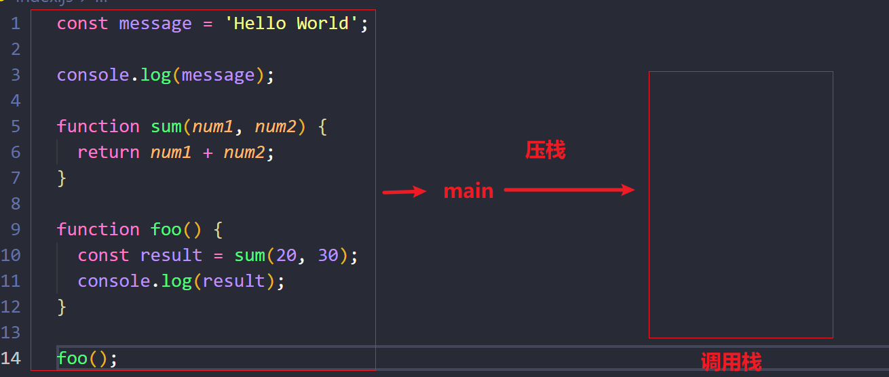
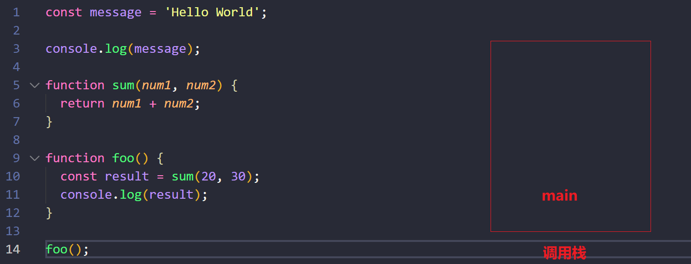
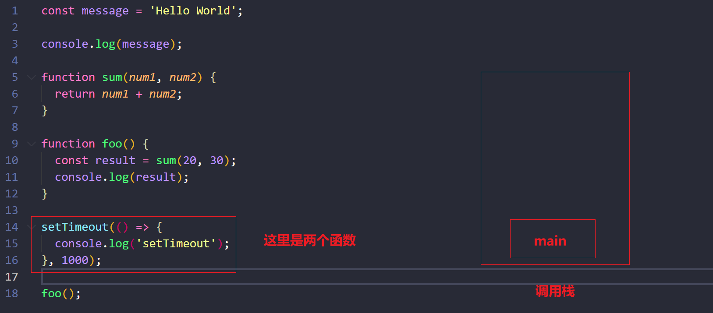

## 事件循环

### 事件循环是什么

- 事实上我把事件循环理解成我们编写的JavaScript和浏览器或者Node之间的一个桥梁。
- 这个桥梁就是事件循环
- 浏览器的事件循环是一个我们编写的JavaScript代码和浏览器API调用(setTimeout/AJAX/监听事件等)的一个桥梁
- 桥梁之间他们通过回调函数进行沟通。
- Node的事件循环是一个我们编写的JavaScript代码和系统调用（file system、network等）之间的一个桥梁, 桥梁之间他们也是通过`回调函数`进行沟通的.


## 进程和线程

### 进程和线程的概念

操作系统是硬件和软件之间链接的桥梁

线程和进程是操作系统中的两个概念：


#### 进程

进程（process）：计算机已经运行的程序，是操作系统管理程序的一种方式；

一个应用程序就是一个进程，比如一个qq，一个微信，但是一个应用程序也不一定就只有一个进程，浏览器就是多进程的


#### 线程

线程（thread）：操作系统能够运行运算调度的最小单位，通常情况下它被包含在进程中；

微信也是有很多代码的，执行这些代码就是通过线程来执行的


#### 进程/线程通俗解释

听起来很抽象，这里还是给出通俗一些的解释：

- 进程：我们可以认为，启动一个应用程序，就会默认启动一个进程（也可能是多个进程）；
- 线程：每一个进程中，都会启动至少一个线程用来执行程序中的代码，这个线程被称之为主线程；
- 一个进程可能有很多线程
- 所以我们也可以说进程是线程的`容器`；

再用一个形象的例子解释：

- 操作系统类似于一个大工厂；
- 工厂中里有很多车间，这个车间就是进程，进程本身不做事情；
- 每个车间可能有一个以上的工人在工厂，这个工人就是线程，事情都是工人在做的；


## 操作系统的工作方式

操作系统是如何做到同时让多个进程（边听歌、边写代码、边查阅资料）同时工作呢？

- 如果cpu是单核的会在线程中快速切换，如果是多核的会同时运行多个线程

- 这是因为CPU的运算速度非常快，它可以快速的在多个进程之间迅速的切换；
- 当我们进程中的线程获取到时间片时，就可以快速执行我们编写的代码；
- 对于用户来说是感受不到这种快速的切换的；

你可以在Mac的活动监视器或者Windows的资源管理器中查看到很多进程：


这里有进程名称，还有线程，比如网易云音乐是一个进程，它开启了19个线程


## 浏览器中的JavaScript线程

我们经常会说JavaScript是单线程的，但是JavaScript的线程应该有自己的容器进程：浏览器或者Node。 

浏览器是一个进程吗，它里面只有一个线程吗？

- 目前多数的浏览器其实都是多进程的，当我们打开一个tab页面时就会开启一个新的进程，这是为了防止一个页 面卡死而造成所有页面无法响应，整个浏览器需要强制退出；
- 每个进程中又有很多的线程，其中包括执行JavaScript代码的线程；


JavaScript的代码执行是在一个单独的线程中执行的：

- 这就意味着JavaScript的代码，在同一个时刻只能做一件事；
- 如果这件事是非常耗时的，就意味着当前的线程就会被阻塞；


### 代码的执行过程

如果代码是跑在浏览器中，我们在.html中引入这个文件

/index.js

```js
const message = 'Hello World';

console.log(message);

function sum(num1, num2) {
  return num1 + num2;
}

function foo() {
  const result = sum(20, 30);
  console.log(result);
}

foo();
```


首先，顶层的代码可以看成是放在main函数里面执行，如果把他看成一个main函数的话，实际上在代码执行的过程中，是把函数压入栈当中，然后运行的。



栈只有一个口，就意味着，先进后出，有这样一个特点。首先要执行这个main， 那么这个main就会压入这个栈里面去




main在执行的过程中，会依次执行左侧的代码，当执行到`log`的时候，log是一个函数，那么它也会进栈，但是，他一执行，打印完就结束了，也就是出栈了，所以他就不在栈里面了，然后定义函数，定义函数不会执行，只有最后调用foo函数的时候，才会压栈，foo压栈之后，继续把sum压栈，等sum执行完了之后，会把sum弹出栈，接着foo弹出栈，foo执行完了，main也就执行完了，就会把main也弹出栈

这个东西就是函数调用栈

如果代码中有异步操作呢？


### 代码中存在异步操作

/index.js

```js
const message = 'Hello World';

console.log(message);

function sum(num1, num2) {
  return num1 + num2;
}

function foo() {
  const result = sum(20, 30);
  console.log(result);
}

setTimeout(() => {
  console.log('setTimeout');
}, 1000);

foo();
```




setTimeout实际上是两个函数，一个是setTimeout函数，另一个是回调函数，代码从上往下执行，当执行到setTimeout的时候，setTimeout也会进栈，但是它一执行，执行了之后立马就会结束，结束之后就会被弹出栈，虽然setTimeout也做了一些操作，但是对于我们来说，他立马就结束了，结束了之后他就调用foo，foo进栈之后开始执行代码后，sum开始进栈，然后sum代码执行完了之后sum出栈，然后foo出栈，然后main出栈，这个时候栈里面就没有东西了。

setTimeout不会阻塞栈里面执行东西的，因为一旦阻塞，那么线程就阻塞了，不会执行其他的代码了，为什么不会阻塞呢？因为我们的浏览器维护着一个非常重要的东西叫做事件循环


## 浏览器的事件循环

上面我们有说到setTimeout函数不会阻塞线程的继续执行

- 中间我们插入了一个setTimeout的函数调用；
- 这个函数被放到入调用栈中，执行会立即结束，并不会阻塞后续代码的执行；
- 那么，setTimeout传入的一个函数（比如我们称之为timer函数），会在什么时候被执行呢？
- 事实上，setTimeout是调用了web api, 在合适的时机，会将timer函数加入到一个事件队列中
- 事件队列中的函数，会被再次放入到调用栈中，在调用栈中被执行


函数调用的时候，会压入栈，弹出栈，压入栈，弹出栈..., 就是这样一个过程，它没有产生任何的阻塞，没有产生任何的阻塞就意味着你在这里所有的函数都会被调用完的，就意味着调用栈最后会变成空的，但是在setTimeout函数执行的时候，浏览器这边会通过某种方式保存timer这个函数，比较常见的方法是保存在红黑树里面的，等到了setTimeout函数设置的时间到了之后，就会把保存的那个函数给取出来，把这个函数放入到事件队列里面了


> 队列：先进先出


当事件循环发现这个队列中发现有需要执行的任务（函数）的时候，他就会按照队列的出队规则，一个一个的放到调用栈里面，放到调用栈之后，就会执行放入的函数，做函数内的各种操作


> 总结： 调setTimeout的时候，不阻塞线程，他会将回调函数放到浏览器的某个地方保存，并且会看一下什么时候会达到时间，一旦达到了这个时间之后，它就会将这个回调函数放入到事件队列里面，而事件循环一旦发现你这个事件队列存在任务，他就会把这个任务取出来，放入到线程调用栈里面进行执行，所以这个函数就可以正常执行了，但是事件队列不只有一个任务，在我们这个过程当中，用户点击了浏览器的某一个按钮，我们对这个事件做了监听，监听的话对应的是一个回调函数，这个回调函数也会被加入到队列里面的。队列里面的任务按照顺序谁先进来谁先执行，那如果还有ajax，它也是加入到事件队列里面的。


## 浏览器的宏任务和微任务

所有的回调函数都是放到一个队列

> 一般队列中加的都是回调函数，很少会加其他东西，这些机制，每一个回调函数就是一个任务，而这种任务被称为`macrotask queue` 宏任务，宏任务会被加入到宏任务队列


但是事件循环中并非只维护着一个队列，事实上是有两个队列：

- 宏任务队列（macrotask queue）：ajax、setTimeout、setInterval、DOM监听、UI Rendering等
- 微任务队列（microtask queue）：Promise.then的回调、 Mutation Observer API、queueMicrotask()等

所以，不同的回调会加入到不同的队列里面的

现在有一个问题就是，有两个队列，那么怎么来取这两个队列的任务呢，或者说按照什么样的顺序来取这两个队列的任务呢？

浏览器中优先执行微任务队列，在两个队列中都存在任务的情况下，优先执行微任务队列，并且在你微任务队列所有的任务全部都执行完了之后，开始执行宏任务队列，在执行完一个宏任务之后，它不会紧接着执行下一个宏任务，他会先看一下在执行这个任务的过程当中有没有往微任务队列中又加任务，如果又加入了任务，那么就不是执行下一个宏任务，而是优先执行新加入的微任务，也就是说，只要微任务队列中存在任务，就先执行微任务，只有微任务队列为空的时候，才会继续执行宏任务。


> 总结一下：
>
> - 1.main script中的代码优先执行（编写的顶层script代码）；
> - 2.在执行任何一个宏任务之前（不是队列，是一个宏任务），都会先查看微任务队列中是否有任务需要执行
>   - 也就是宏任务执行之前，必须保证微任务队列是空的；
>   - 如果不为空，那么就优先执行微任务队列中的任务（回调）；
>
> 


### 宏任务微任务面试题 

下面我们通过几到面试题来练习一下。

```js
setTimeout(function () {
  console.log("set1");
  new Promise(function (resolve) {
    resolve();
  }).then(function () {
    new Promise(function (resolve) {
      resolve();
    }).then(function () {
      console.log("then4"); 
    });
    console.log("then2");
  });
});

new Promise(function (resolve) {
  console.log("pr1");
  resolve();
}).then(function () {
  console.log("then1");
});

setTimeout(function () {
  console.log("set2");
});

console.log(2);

queueMicrotask(() => {
  console.log("queueMicrotask1")
});

new Promise(function (resolve) {
  resolve();
}).then(function () {
  console.log("then3");
});

// pr1
// 2
// then1
// queuemicrotask1
// then3
// set1
// then2
// then4
// set2
```


```js
async function async1 () {
  console.log('async1 start')
  await async2();
  console.log('async1 end')
}
 
async function async2 () {
  console.log('async2')
}

console.log('script start')

setTimeout(function () {
  console.log('setTimeout')
}, 0)
 
async1();
 
new Promise (function (resolve) {
  console.log('promise1')
  resolve();
}).then (function () {
  console.log('promise2')
})

console.log('script end')


// script start
// async1 start
// async2
// promise1
// script end
// aysnc1 end
// promise2
// setToueout
```


```js
async function async1() {
  console.log('async1 start')
  await async2()
  console.log('async1 end')
}

async function async2() {
  console.log('async2')
}

console.log('script start')

setTimeout(function () {
  console.log('setTimeout0')
}, 0)

setTimeout(function () {
  console.log('setTimeout2')
}, 300)

setImmediate(() => console.log('setImmediate'));

process.nextTick(() => console.log('nextTick1'));

async1();

process.nextTick(() => console.log('nextTick2'));

new Promise(function (resolve) {
  console.log('promise1')
  resolve();
  console.log('promise2')
}).then(function () {
  console.log('promise3')
})

console.log('script end')


// script start
// async1 start
// async2
// promise1
// promise2
// script end
// nextTick1
// nextTick2
// async1 end
//  promise3
// setTimeout0
// setImmediate
// setTimeout2
```


```js
setTimeout(() => {
  console.log("setTimeout");
}, 0);

setImmediate(() => {
  console.log("setImmediate");
});

// 问题: setTimeout setImmediate
```


## Node的事件循环

当用node来执行代码的时候，它也会给你开启一个进程的，node进程也是多线程的，其中有一个js线程，js线程是用来执行js代码的，其中有线程可以执行setTimeout操作，也有线程执行文件读取操作，也有线程执行网络请求操作，这些操作都是由node中的其他线程来做的，其他线程做完这些操作之后，将做完这些事情之后，执行一个回调函数，将回调函数加入到队列中，然后js线程回调这些函数，获取到结果，所有node的事件循环和浏览器的事件循环是差不多的


浏览器中的EventLoop是根据HTML5定义的规范来实现的，不同的浏览器可能会有不同的实现，而Node中是由 libuv实现的。


### node架构图介绍

这里我们来给出一个Node的架构图：

- 我们会发现libuv中主要维护了一个EventLoop和worker threads（线程池）；
- EventLoop负责调用系统的一些其他操作：文件的IO、Network、child-processes等

libuv是一个多平台的专注于异步IO的库，它最初是为Node开发的，但是现在也被使用到Luvit、Julia、pyuv等其 他地方；


 application对应的就是我们的javascript代码也可能是一些库， 因为我们一般的应用程序都是使用javascript来编写的，当然我们也可以用c++来编写，把他转成.node文件，但是比较少一些，一般是对整个node框架做扩展的时候才会用c++代码，一般我们直接用javascript来编写就可以了。

因为操作系统是不识别`javaScript`代码的，这个时候就需要`V8引擎`对我们的代码做一个翻译，这样的话计算机才能执行，而执行的话，很可能会去读取一个文件，例如用`fs模块`去读取文件，读取文件就是一个系统调用操作，也就是它需要调用系统内核中的系统调用相关的函数，才能对系统进行操作，也就是即使你通过V8进行翻译了，你还需要通过一些其他的操作才能读取文件，那么这个过程是怎么做的呢，`node`中有一个东西叫做`BINDINGS`，`javaScripts`代码需要经过V8翻译之后经过`BINDINGS`处理，然后还要经过`LIBUV`这个库来处理更多的东西，例如事件循环。`LIBUV`是`node`当中一个非常重要的组成，`LIBUV`包含一个非常重要的东西叫做`EVENT LOOP`，也就是`事件循环`，这里的一些读取文件操作，网络请求，子进程等操作，它们本质上都是调用`LIBUV`, 而`LIBUV`才是真正和系统进行沟通的桥梁，而`LIBUV`有一个非常重要的东西叫做`事件循环`。当然还有一个重要的东西叫做`WORKER THREADS`, 他叫做`工作线程`，也可以称为`线程池`。

node其实更多的做的是一个文件的操作，浏览器做的更多的是渲染的操作，它们是的大同小异的

node是经过很多语言开发的，node最重要的包括V8和libuv


假如通过fs模块调用了fs.readFile()，我们这样写是javascript代码，经过V8翻译，但是我们这里是读取文件的操作，V8是不会直接进行读取文件的操作，他会利用另外的东西，也就是BINDINGS，然后就会来到LIBUV，而真正和我们操作系统中的文件系统进行操作，这部分的操作是在LIBUV中做的，也就是说文件系统的沟通是node中的LIBUV来做的，等LIBUV获取到文件的信息之后再返回到javascript当中去。总之与操作系统的沟通是LIBUV来做的，那么他到底是怎么做的呢？


### 阻塞IO和非阻塞IO

如果我们希望在程序中对一个文件进行操作，那么我们就需要打开这个文件：通过文件描述符（前面讲过）。


### 系统调用

JavaScript可以直接对一个文件进行操作吗？

看起来是可以的，但是事实上我们任何程序中的文件操作都是需要进行系统调用（操作系统的文件系统）；

> 任何一个操作系统，都包含一个非常重要的组成部分，就是**文件系统**，文件系统就是操作系统封装起来对文件进行操作的一系列的方法
>
> 而操作系统在封装了这些方法以后，我们的应用程序再在已经封装的这一层调用提供给我们的函数，这一层的调用，我们称之为系统调用
>
> `javascript`代码在操作系统调用之后，文件系统就会返回对应的东西。


而在node这个架构中，上面说的这部分访问/操作就是在libuv中完成的，而我们这里写的是javascript代码，而整个javascript代码还需要经过V8引擎的翻译，才能最终完成调用文件系统，那么所有的调用文件系统的这些操作就组成了我们的node或者node的一部分，通俗来说，就是libuv调用的是系统封装的文件调用，我们调用的是libuv封装的调用


### IO操作

事实上对文件的操作，是一个操作系统的IO操作（输入、输出）；


> 总之你要进行一个系统调用就是你对文件进行操作，本质上就是一个系统调用，系统调用也可以说是一个IO的系统调用，IO就是输入输出，我们可以输入一些东西，输出一些东西。
>
> 其实操作系统的话，是操作系统给我们提供了函数，然后我们才能进行系统调用，而操作系统给我们提供的函数的话，他其实很多种情况下，是包含两种方式的，一种方式是阻塞式调用，另一种方式是非阻塞式调用


### 阻塞式调用和非阻塞式调用介绍

操作系统为我们提供了阻塞式调用和非阻塞式调用：

- 阻塞式调用： 调用结果返回之前，当前线程处于阻塞态（阻塞态CPU是不会分配时间片的），调用线程只有在得到调用结果之后才会继续执行。
- 非阻塞式调用： 调用执行之后，当前线程不会停止执行，只需要过一段时间来检查一下有没有结果返回即可。

所以我们开发中的很多耗时操作，都可以基于这样的非阻塞式调用：

- 比如网络请求本身使用了Socket通信，而Socket本身提供了select模型，可以进行非阻塞方式的工作；
- 比如文件读写的IO操作，我们可以使用操作系统提供的基于事件的回调机制；


#### 阻塞式底层介绍

就是如果我这次在调用操作系统里面的某一个系统调用，我在对它进行调用，要操作这个文件的时候，假如说我用的是阻塞式调用，到时候，你在执行代码所在的这个线程，到时候它是处于一个阻塞态的，线程他有一种状态叫阻塞态，一旦你处于阻塞态的时候，cpu就不会再给你分配时间片，也就意味着，你这里的代码就不会执行，也就是你当前这里被阻塞了，你当前就处于阻塞状态了，那为什么要阻塞呢？原因非常简单，因为我正在你操作系统里面读取文件里面的信息，那你必须等到我把所有的数据都给你的时候，也就是说你读到了我这里的数据，你把里面的东西都读完了之后，你这个线程会从新回归到就绪态，就绪态就是cpu在他有这个时间片的时候，在他进行调度的时候，他就给你分配时间片，你就可以继续执行你后续的代码了，这个就是阻塞调用，就是你在阻塞态的时候，你在等的时候，cpu是不会给你分配时间片，让你来执行代码的。


#### 非阻塞式底层介绍

阻塞调用时什么意思，非阻塞就是不阻塞，不阻塞就是我在我这里操作我这个文件的时候，一旦调用结束，他会立马返回结果，也就是说当前这里是不会阻塞的，它立马会返回结果，返回结果就意味着我当前这个线程里面会继续执行后续的代码，后续的东西全部都是依然能继续执行的，这个就是非阻塞调用


#### 阻塞和非阻塞的优缺点

其实操作系统很多的功能上，都给我们提供了这两种方式，而我们采用哪种方式会更好一点呢，相对来说非阻塞式调用用的会更多一点，为什么呢，因为我不会让我的线程在这里傻傻的等着，那如果你想进行非阻塞调用的话，比如说你现在做的是一socket通信这么一个东西的话，这个东西一般的操作系统都会给你提供一个select模型，这个select模型的作用就是进行非阻塞式调用的一种工作，你可以采用这种东西来进行调用，还有一种的话就是文件读写的IO操作，IO操作的话，很多操作系统都会给我们提供一个基于事件的回调机制，那你采用这种机制的话，他也是一种非阻塞式的调用，就意味着我的线程可以继续执行其他的操作


#### 非阻塞IO的问题

但是非阻塞式调用也有另外的一些问题，什么问题，因为刚才我一旦调用完了的话，你立马就给我返回了一个结果，但是我这个文件里面的信息压根就没有读完，你现在给我返回一个结果，我拿到的是一个正确的结果吗，我能拿到你读取的正确数据吗？肯定是拿不到的，所以呢，它返回的结果肯定不是我们想要的结果

那既然不是我们想要的结果，就意味着我们需要在这个位置，通过某种方式不断的继续去读取，不断的继续读取的过程当中，我还得询问一下当前的文件有没有读完，只有读完了之后，我才能把我真正完整的文件数据才能传给我的程序，让我的程序去处理这个文件里面相关的一些数据，它是必须要这样来做的

> 那么就意味着为了可以知道是否读取到了完整的数据，我们需要频繁的去确定读取到的数据是否是完整的；


所以非阻塞式的调用它最大的问题就是你必须要知道什么时候这个处理它已经结束了，那如果我们不断的来这里询问，不断的在这里循环，让我的线程不断的询问的话，查看一下有没有读完的话，其实这种询问的过程的话就做轮询

通过轮询的操作，我不断的问你，不断的问你数据有没有读取完成，如果读取完成的话，我再去做其他的操作。那这个轮询它必然是消耗性能的，那谁来帮我们做这个轮询呢？如果你主线程来做这个轮询，那你主线程不是相对来说的话也是非常非常消耗性能的，如果你不断的做这个事情，那你其他的操作性能会降低的，所以会大大降低我们的性能，而且在真正的开发里面我们不可能只进行一个文件的读写，可能有多个文件，可能会对多个文件进行操作，而且相关的IO也可能不只有一个，可能有文件的IOD,可能有网络的IO，可能有数据库的IO，甚至有一些子线程的调用，子线程的调用我也得知道你什么时候调用完了，等等，就是我必须知道一个结果，但是呢，我不能让我的主线程来执行这个轮询

> - 如果我们的主线程频繁的去进行轮训的工作，那么必然会大大降低性能；
> - 并且开发中我们可能不只是一个文件的读写，可能是多个文件；
> - 而且可能是多个功能：网络的IO、数据库的IO、子进程调用；


那这个时候怎么办呢？那么这个轮询的工作由谁来完成呢？


#### LIBUV如何帮助我们操作文件系统

其实在LIBUV里面他给我们提供了一个东西，当然些东西都不需要我们开发，这些东西都是底层的一些东西，libuv里面的话给我们提供了一个东西叫做线程池，那在libuv里面他就给我们提供了一个线程池，线程池的话他会负责相关的这些操作，并且的话他可以通过轮询的方式或者一些其他的方式都是可以的，不一定就是轮询，因为不同的操作系统的话，他会有一些不同的机制，总之他这里的话会有一个线程池，线程池的话，是什么东西呢，线程池的话就是一个线程的池子，里面的话有非常非常多的线程，这些线程的话可以为我所用，当我想做某一个操作的时候，我可以拿到一个线程，单独的帮助我完成这么一个操作，比如说刚才提到的轮询操作，你就帮我完成，那等你帮我完成之后，我javascript那边我怎么知道你完成了这个操作呢，非常简单，这个时候核心就来了，它是通过事件循环的


#### 事件循环

他会将我们这次读到的数据连同我们之前注册的回调函数，还有我们注册的回调函数，可以想象一下，我们在读取文件的时候，我们如果采用的是我们异步的方式，我们是不是会传入一个回调函数啊，他会把我们的数据或者有error，他会将这部分东西，也就是回调函数，他会扔入到我们的事件循环里面的某一个事件队列里面，我们知道在浏览器里面，浏览器最主要维护了两个队列，一个是宏任务，一个是微任务，总之的话肯定是有队列的，而我们刚才的这些回调函数，就会被扔入到事件队列中，那一旦扔入到事件队列里面，事件循环是不是会不断的执行，不断的执行，也就是不断的从事件队列里面取出来东西执行，那这个时候等执行完了某一个事件的时候，他就会告诉javascript端，你完成了这个事件，就会把这个回调函数放入到js的执行栈中进行执行，一旦你函数执行完了之后，你再弹出来就可以了，所以整个的过程就是这样


他这里的工作的线程其实就是我们前面提到的线程池，从这个线程池里面取出来某一个线程来帮我们工作的，当我们拿到对应数据的话，他是要执行我们的callback，其实并不是直接执行的，它会将我们的callback放到队列里面的，而放入到队列里面的话，在我们的event loop在他执行我们的事件循环过程当中，把那个再给他传回到我们的javascript端，然后让这个回调函数在js的主线程中进行执行


> libuv提供了一个线程池（Thread Pool）：
>
> - 线程池会负责所有相关的操作，并且会通过轮训等方式等待结果；
> - 当获取到结果时，就可以将对应的回调放到事件循环（某一个事件队列）中；
> - 事件循环就可以负责接管后续的回调工作，告知JavaScript应用程序执行对应的回调函数；


这样的话，整个流程就打通了，这个就是关于libuv的沟通，最核心的东西就是event loop和work threads

这个就是node中libuv帮助我们做的事情


#### 阻塞和非阻塞，同步和异步的区别？

阻塞和非阻塞，同步和异步有什么区别？

阻塞和非阻塞是对于被调用者来说的；

- 在我们这里就是系统调用，操作系统为我们提供了阻塞调用和非阻塞调用；
- 那么对于操作系统来说他提供了阻塞式和非阻塞式

同步和异步是对于调用者来说的；

- 在我们这里就是自己的程序；
- 如果我们在发起调用之后，不会进行其他任何的操作，只是等待结果，这个过程就称之为同步调用；
- 如果我们再发起调用之后，并不会等待结果，继续完成其他的工作，等到有回调时再去执行，这个过程就是 异步调用；

Libuv采用的就是非阻塞异步IO的调用方式；


### node事件循环的阶段

我们最前面就强调过，事件循环像是一个桥梁，是连接着应用程序的JavaScript和系统调用之间的通道：

- 无论是我们的文件IO、数据库、网络IO、定时器、子进程，在完成对应的操作后，都会将对应的结果和回调函数放到事件循环（任务队列）中；
- 事件循环会不断的从任务队列中取出对应的事件（回调函数）来执行；
- 所以js是不会发送网络请求的，网络请求是浏览器去做的，浏览器是调用操作系统去做的
- 所以说，事件循环更像是一个桥梁，它是链接我们js做不了的东西
- 所以为什么说早期js是用在浏览器的
- 但是现在js也可以用在浏览器开发中，为什么可以用在服务器中呢？服务器开发有什么要求呢？
- 就是进行IO的操作，I就是input，O就是output操作
- 也就是读取一些到程序里面
- 写入一些到程序外面
- 可以写入一个文件到本地里面
- 也可以输入一些文件到数据库中
- 但是现在可以通过libuv来调用相对的任务写入或者输出任务
- 这就是为什么js可以用在服务器开发，就是因为node通过libuv可以操作很多东西

但是一次完整的事件循环Tick分成很多个阶段：

tick可以想象成钟表中秒针的一次滴答

一次tick就成为一次滴答

这些就是一次tick做的事情

- 定时器（Timers）：本阶段执行已经被 setTimeout() 和 setInterval() 的调度回调函数。
- 待定回调（Pending Callback）：对某些系统操作（如TCP错误类型）执行回调，比如TCP连接时接收到 ECONNREFUSED（error connection refused)。
- idle, prepare：仅系统内部使用。
- 轮询（Poll）：检索新的 I/O 事件；执行与 I/O 相关的回调；
- 检测（check）：setImmediate() 回调函数在这里执行。
- 关闭的回调函数：一些关闭的回调函数，如：socket.on('close', ...)。

node实际上维护了非常多的队列，这些每一个可能都属于一个队列


### Node事件循环的阶段图解


在线程池完成的一些操作都会给到poll（轮询）这个阶段

上面这些都是宏任务


### Node的宏任务和微任务

我们会发现从一次事件循环的Tick来说，Node的事件循环更复杂，它也分为微任务和宏任务：

- 宏任务（macrotask）：setTimeout、setInterval、IO事件、setImmediate、close事件；
- 微任务（microtask）：Promise的then回调、process.nextTick、queueMicrotask；
  - Promise的then回调、queueMicrotask在一个微任务队列，process.nextTick在另外一个微任务队列

但是，Node中的事件循环不只是微任务队列和宏任务队列：

- 微任务队列：
  - next tick queue：process.nextTick；
  - other queue：Promise的then回调、queueMicrotask；
- 宏任务队列：
  - timer queue：setTimeout、setInterval；
  - poll queue：IO事件；
  - check queue：setImmediate；
  - close queue：close事件；

node的宏任务和微任务也是和浏览器一样的，都是微任务执行完了以后才执行宏任务的


### node事件循环的顺序

上面的队列非常多，微任务可能有很多队列，宏任务也有很多队列

每一次的事件循环，需要经过上面所有的队列，例如setTimeout，setInterval, IO事件等

所以，在每一次事件循环的tick中，会按照如下顺序来执行代码：

微任务

- next tick microtask queue；
- other microtask queue；其他微任务队列

宏任务

- timer queue；setTimeout、setInterval
- poll queue；IO队列（因为文件的操作不一定什么时候回调，所以这个一般不确定它的顺序）
- check queue；setImmediate
- close queue；close队列


### Node执行面试题


```js
async function async1() {
  console.log('async1 start')
  await async2()
  console.log('async1 end')
}

async function async2() {
  console.log('async2')
}

console.log('script start')

setTimeout(function () {
  console.log('setTimeout0')
}, 0)

setTimeout(function () {
  console.log('setTimeout2')
}, 300)

setImmediate(() => console.log('setImmediate'));

process.nextTick(() => console.log('nextTick1'));

async1();

process.nextTick(() => console.log('nextTick2'));

new Promise(function (resolve) {
  console.log('promise1')
  resolve();
  console.log('promise2')
}).then(function () {
  console.log('promise3')
})

console.log('script end')


// script start
// async1 start
// async2
// promise1
// promise2
// script end
// nextTick1
// nextTick2
// async1 end
//  promise3
// setTimeout0
// setImmediate
// setTimeout2
```

第一次main script执行完了


接下来事件循环开始工作了


没有东西了，但是事件循环依然在执行的，并没有结束，因为setTimeout2延迟了，意味着这个时候事件循环依然在执行，就是它的时间到了之后，会将它加入到timers中

然后下一次tick的时候会将他执行


所有的执行完了之后，程序就会退出，线程就会退出


### setTimeout和setImmediate

```js
setTimeout(() => {
  console.log("setTimeout");
}, 0);

setImmediate(() => {
  console.log("setImmediate");
});

// 问题: setTimeout setImmediate
// 可能会setTimeout先执行，也可能setImmediate  
```


为什么会出现不同的情况呢？

- 在Node源码的deps/uv/src/timer.c中141行，有一个 uv__next_timeout 的函数；
- 这个函数决定了，poll阶段要不要阻塞在这里；
- 阻塞在这里的目的是当有异步IO被处理时，尽可能快的让代码被执行；

和上面有什么关系呢？

情况一：如果事件循环开启的时间(ms)是小于 setTimeout函数的执行时间的；

- 也就意味着先开启了event-loop，但是这个时候执行到timer阶段，并没有定时器的回调被放到入 timer queue中；
- 所以没有被执行，后续开启定时器和检测到有setImmediate时，就会跳过poll阶段，向后继续执行；
- 这个时候是先检测 setImmediate，第二次的tick中执行了timer中的setTimeout；

情况二：如果事件循环开启的时间(ms)是大于 setTimeout函数的执行时间的；

- 这就意味着在第一次tick中，已经准备好了timer queue；
- 所以会直接按照顺序执行即可；


它会在轮询的阶段，尽可能的停留，等待的，但是后面有其他操作怎么办呢？


如果事件循环的初始化的时间大于setTimeout将回调函数放到timers的时间，那么先执行setTimeout函数，否则先执行setImmediate函数


所以真正耗时的操作，实际上并不是由JavaScript线程在执行的：

- 浏览器的每个进程是多线程的，那么其他线程可以来完成这个耗时的操作；
- 比如网络请求、定时器，我们只需要在特性的时候执行应该有的回调即可；
  - 网络请求，只是你发了一个指令，发送指令以后，浏览器建立链接，发送数据，断开链接，等等（浏览器的其他线程做的）这些事情不是js做的，沟通完了以后，告诉js线程，也就是再回调，这个网络请求执行完了
  - 定时器，当我们开启定时器的时候，我们给浏览器发送一个指令，告诉浏览器我们要做一个2秒钟的定时，浏览器拿到这个指令以后会做一个两秒钟的定时，然后再回到js线程，回调2秒钟的函数
    - 这个两秒钟是由浏览器的其他线程做的
    - 这个过程中，浏览器怎么知道是否两秒钟到了，我们可以去执行回调2秒钟的函数呢？
    - 当时间到了以后，它是把他放到事件队列中的，js线程会去队列中取的


## 

如果在执行JavaScript代码的过程中，有异步操作呢？

- 中间我们插入了一个setTimeout的函数调用；
- 这个函数被放到入调用栈中，执行会立即结束，并不会阻塞后续代码的执行；


setTimeout是同步的，之所以说setTimeout异步，是只setTimeout传入的函数是异步函数


在执行的过程中，setTimeout不会立即执行这个函数，而是在1秒钟之后执行，但是这个时候js线程不会等待一秒钟之后执行后面的代码，而是马上执行后面的代码，那么这个一秒钟之后执行的函数会被浏览器放到其他的地方（事件队列中），然后浏览器开始计时（计时操作也是一个线程，浏览器会执行相应的代码）。

那么一秒钟之后是怎么执行这个函数的呢？

浏览器维护着一个队列的，被称为事件队列，默认是空的

队列本身是一个数据结构，是一个线性结构，特点是先进先出

当我们执行到计时器，发现有一个函数是一秒钟之后执行，那么我们会把这个函数放到队列中

当我们的时间到了以后，js线程会从这个队列中取到这个函数并执行


js进程、其他进程、事件队列这三部分组成了一个环，这个环 就被称为浏览器的事件循环


