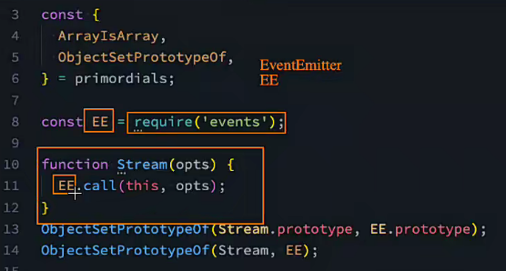

## 认识Stream

### 流

什么是流呢？

- 我们的第一反应应该是流水，源源不断的流动；
- 程序中的流也是类似的含义，我们可以想象当我们从一个文件中读取数据时，文件的二进制（字节）数据会源源不 断的被读取到我们程序中；
- 而这个一连串的字节，就是我们程序中的流（字节流）；

所以，我们可以这样理解流：

- 是连续字节的一种表现形式和抽象概念；
- 流应该是可读的，也是可写的；

在之前学习文件的读写时，我们可以直接通过 readFile或者 writeFile方式读写文件，为什么还需要流呢？

- 直接读写文件的方式，虽然简单，但是无法控制一些细节的操作； 
- 比如从什么位置开始读、读到什么位置、一次性读取多少个字节； 
- 读到某个位置后，暂停读取，某个时刻恢复读取等等； 
- 或者这个文件非常大，比如一个视频文件，一次性全部读取并不合适；


### 流的应用

事实上Node中很多对象是基于流实现的：

- http模块的Request和Response对象；
- process.stdout对象；

官方：另外所有的流都是EventEmitter的实例：



Node.js中有四种基本流类型：

- Writable：可以向其写入数据的流（例如 fs.createWriteStream()）。 
- Readable：可以从中读取数据的流（例如 fs.createReadStream()）。 
- Duplex：同时为Readable和的流Writable（例如 net.Socket）。 
- Transform：Duplex可以在写入和读取数据时修改或转换数据的流（例如zlib.createDeflate()）。


## Readable流的使用

之前我们读取一个文件的信息：

/foo.txt

```txt
Hello World
```


/index.js

```js
const fs = require('fs');

fs.readFile('./foo.txt', {encoding: 'utf8'}, (err, data) => {
  console.log(data);
})

$ node index.js
Hello World
```


这种方式是一次性将一个文件中所有的内容都读取到程序（内存）中，但是这种读取方式就会出现我们之前提到的 很多问题：

- 文件过大、读取的位置、结束的位置、一次读取的大小；

这个时候，我们可以使用 createReadStream，我们来看几个参数，更多参数可以参考官网：

- start：文件读取开始的位置；
- end：文件读取结束的位置；
- highWaterMark：一次性读取字节的长度，默认是64kb；

所以我们可以通过流的方式读取


### Readable读取

创建文件的Readable，并监听它，它的参数有很多东西，参考官网

```js
const fs = require('fs');
fs.readFile('./test.txt', (err, data) => {
  console.log(data);
})

// render是一个stream
const render = fs.createReadStream('./test.txt', {
  start: 2, // 从字节的第二个字符开始
  end: 6, // 读到第6个字符，不包含第6个字符
  highWaterMark: 2  // 每次读两个字符
})


// 监听读取到的流
// 可以通过监听data事件，获取读取到的数据；
render.on('data', (data) => {
  /**
   * <Buffer a0 e5>
   * <Buffer a5 bd>
   * <Buffer e5>
   */
  console.log(data);
})
```


**打开文件/关闭文件/文件读取完毕**

```js
const fs = require('fs');
fs.readFile('./test.txt', (err, data) => {
  console.log(data);
})

const render = fs.createReadStream('./test.txt', {
  start: 2, // 从字节的第二个字符开始
  end: 6, // 读到第6个字符，不包含第6个字符
  highWaterMark: 2  // 每次读两个字符
})


// 监听读取到的流
render.on('data', (data) => {
  console.log(data);
})

render.on('open', () => {
  console.log('文件被打开')
})

render.on('close', () => {
  console.log('文件关闭')
})

render.on('end', () => {
  console.log('文件读取完毕')
})

/**
 * 文件被打开
 * <Buffer a0 e5>
 * <Buffer e4 bd a0 e5 a5 bd e5 95 8a ef bc 8c e6 9d 8e e9 93 b6 e6 b2 b3 ef bc 81>
 * <Buffer a5 bd>
 * <Buffer e5>
 * 文件读取完毕
 * 文件关闭
 */
```

这样做就能对文件做更精准的一个读取


**暂停数据流**

```js
const fs = require('fs');
fs.readFile('./test.txt', (err, data) => {
  console.log(data);
})

const render = fs.createReadStream('./test.txt', {
  start: 2, // 从字节的第二个字符开始
  end: 6, // 读到第6个字符，不包含第6个字符
  highWaterMark: 2  // 每次读两个字符
})


// 监听读取到的流
render.on('data', (data) => {
  console.log(data);
  render.pause(); // 暂停读取数据流
  setTimeout(() => {
    render.resume();  // 继续读取数据流
  }, 2000);
})
```

每隔两秒读一次数据流，并且暂停，等到两秒后再读，直到读到第6个字节

将读到的文件按照中文显示

```js
const fs = require('fs');

const reader = fs.createReadStream('./foo.txt', {
  start: 3,   //从第三个字符读取
  end: 10, // 读到第6个字符，包含第六个字符
  highWaterMark: 2,  //每次读两个字符
  encoding: 'utf8'	//将读到的字节按照中文编码
}) 
```


## Writable流的使用

之前我们写入一个文件的方式是这样的：

```js
const fs = require('fs');
// 文件路径、写入内容、写入模式、错误回调
fs.writeFile('./bar.txt', '写入文字111', {flag: 'a'}, err => {
  console.log(err);
})
```

这种方式相当于一次性将所有的内容写入到文件中，但是这种方式也有很多问题：

- 比如我们希望一点点写入内容，精确每次写入的位置等；

这个时候，我们可以使用 createWriteStream，我们来看几个参数，更多参数可以参考官网：

- flags：默认是w，如果我们希望是追加写入，可以使用 a或者 a+；
- start：写入的位置；


### writable的写入

我们进行一次简单的写入

```js

const fs = require('fs');
const writer = fs.createWriteStream('./bar.txt', {
  flags: 'a'
})

writer.write('追加的内容', err => {
  console.log('追加写入成功')
})

```

注意：

- 这里的写入仅仅是将 ‘追加的内容’ 写入到 bar.txt 中
- 并且是追加到文本的最后
- 如果想加入到文本中的某一个位置，则需要新增一个option

```js
const fs = require('fs');
const writer = fs.createWriteStream('./bar.txt', {
  flags: 'r+',
  start: 2
})

writer.write('yyyyyy', err => {
  console.log('追加写入成功')
})

```

这种方式虽然能写入到第二个，但是后面的都会被删除掉，例如：xxxxx这个文本如果按照上面的代码追加，则会变成xxyyyyyy


### 监听writable的写入事件

**监听open事件**

```js


const fs = require('fs');
const writer = fs.createWriteStream('./bar.txt', {
  flags: 'r+',
  start: 2,
  encoding: 'utf8'
})

writer.write('嘿嘿嘿', err => {
  if(err) {
    console.log(err);
    return
  }
  console.log('追加写入成功')
})
writer.on('open', () => {
  console.log('文件被打开');
})
writer.on('close', () => {
  console.log('文件关闭了');
})
writer.on('end', () => {
  console.log('文件写入完毕');
})

/**
 * 文件被打开
 * 追加写入成功
 */
```

上面的代码执行会发现打印的有：

​	文件被打开

​	追加写入成功

也就是说监听到了open事件，但是文件关闭事件并没有触发，文件end事件也没有触发

那么就说明，文件并没有关闭，且文件并没有加入完成


也可以一直的写入

```js


const fs = require('fs');
const writer = fs.createWriteStream('./bar.txt', {
  flags: 'r+',
  start: 2
})

writer.write('嘿嘿嘿', err => {
  console.log('第一次写入')
})
writer.write('哈哈哈', err => {
  console.log('第二次写入')
})
writer.on('open', () => {
  console.log('文件被打开');
})
writer.on('close', () => {
  console.log('文件关闭了');
})
writer.on('end', () => {
  console.log('文件写入完毕');
})

/**
 * 文件被打开
 * 第一次写入
 * 第二次写入
 */
```

哪怕多次写入，也可以发现，bar.txt这个文件并没有关闭，也就是close这个事件没有触发

那么怎么关闭文件呢？


### close的监听

我们会发现，我们并不能监听到 close 事件：

- 这是因为写入流在打开后是不会自动关闭的； 
- 我们必须手动关闭，来告诉Node已经写入结束了； 
- 并且会发出一个 finish 事件的；

另外一个非常常用的方法是 end：end方法相当于做了两步操作： write传入的数据和调用close方法；

**方案一：**

```js


const fs = require('fs');
const writer = fs.createWriteStream('./bar.txt', {
  flags: 'r+',
  start: 2,
  encoding: 'utf8'
})

writer.write('嘿嘿嘿', err => {
  if(err) {
    console.log(err);
    return;
  }
  console.log('第一次写入')
})
writer.write('哈哈哈', err => {
  if(err) {
    console.log(err);
    return;
  }
  console.log('第二次写入')
})
writer.on('open', () => {
  console.log('文件被打开');
})

// 关闭文件
writer.close();

writer.on('close', () => {
  console.log('文件关闭了');
})

/**
 * 文件被打开
 * 第一次写入
 * 第二次写入
 * 文件关闭了
 */

```


**方案二：**

```js


const fs = require('fs');
const writer = fs.createWriteStream('./bar.txt', {
  flags: 'r+',
  start: 2,
  encoding: 'utf8'
})

writer.write('嘿嘿嘿', err => {
  if(err) {
    console.log(err);
    return;
  }
  console.log('第一次写入')
})
writer.write('哈哈哈', err => {
  if(err) {
    console.log(err);
    return;
  }
  console.log('第二次写入')
})
writer.on('open', () => {
  console.log('文件被打开');
})

// 关闭文件
// 做了两件事，1：将end的参数写入，2：调用close函数
writer.end();

writer.on('close', () => {
  console.log('文件关闭了');
})

/**
 * 文件被打开
 * 第一次写入
 * 第二次写入
 * 文件关闭了
 */

```


**方案三：**

```js
const fs = require('fs');
const writer = fs.createWriteStream('./bar.txt', {
  flags: 'r+',
  start: 2,
  encoding: 'utf8'
})

writer.on('open', () => {
  console.log('文件被打开');
})

writer.end('哼哼哼');

writer.on('close', () => {
  console.log('文件关闭了');
})

/**
 * 文件被打开
 * 文件关闭了
 */

```


**finish事件，监听事件完成**

```js
const fs = require('fs');
const writer = fs.createWriteStream('./bar.txt', {
  flags: 'r+',
  start: 2,
  encoding: 'utf8'
})

writer.on('open', () => {
  console.log('文件被打开');
})

writer.end('哼哼哼');

writer.on('finish', () => {
  console.log('文件写入完成');
})

/**
 * 文件被打开
 * 文件写入完成
 */

```


## pipe方法

正常情况下，我们可以将读取到的输入流，手动的放到输出流中进行写入：

**方案一：**

```js
const fs = require('fs');
// 传统的写法
fs.readFile('./bar.txt', (err, data) => {
  fs.writeFile('./baz.txt', data, (err) => {
    console.log(err);
  })
})
```


**方案二：**

```js
const fs = require('fs');

// Stream的写法
const reader = fs.createReadStream("./foo.txt");
const writer = fs.createWriteStream('./foz.txt');

fs.readFile('./bar.txt', (err, data) => {
  console.log(data);
  fs.writeFile('./baz.txt', data, (err) => {
    console.log(err);
  })
})

reader.pipe(writer);
writer.close();
```


**方案三：**

```js
const fs = require('fs');
// Stream的写法
const reader = fs.createReadStream("./foo.txt");
const writer = fs.createWriteStream('./foz.txt');

reader.pipe(writer);
// foz.txt 将会把 foo.txt 的内容复制过来
```

